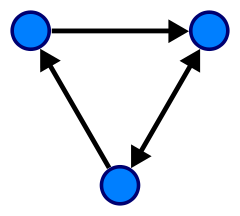
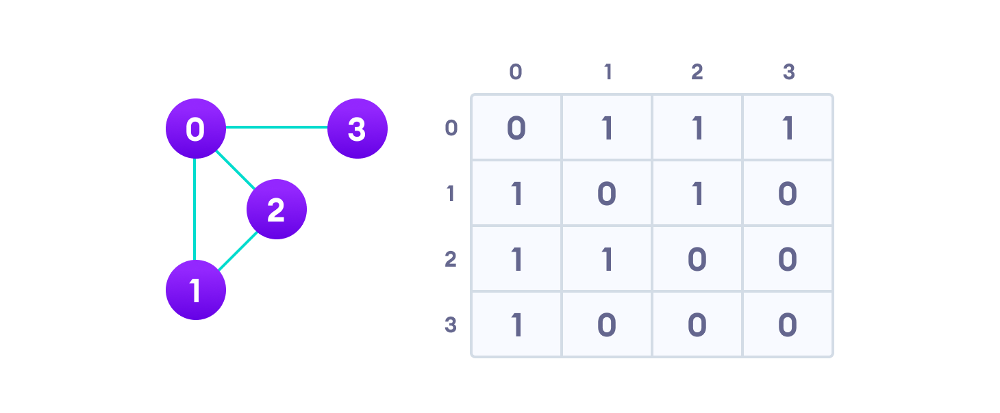
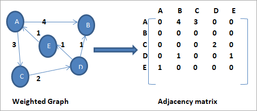

# Graphs {#graphs}

A graph data structure consists of a finite (and possibly mutable) set of vertices (also called nodes or points), together with a set of unordered pairs of these vertices for an undirected graph or a set of ordered pairs for a directed graph. These pairs are known as edges (also called links or lines), and for a directed graph are also known as arrows. 
Figures and tables with captions will be placed in `figure` and `table` environments, respectively.

```{r graph, fig.cap='A directed graph with three vertices and three edges', out.width='30%', out.height='30%', fig.asp=.65, fig.align='center'}

```


A graph data structure may also associate to each edge some edge value, such as a symbolic label or a numeric attribute (cost, capacity, length, etc.).  
Graphs have many real world applications including:

* Locations with connections e.g. airports and flights, railways and train stations, intersections and roads
* Entities with relationships e.g. Social networks, Web pages

We will only consider directed graphs. Undirected graphs can be seen as a special case of a directed graph where the edge can be seen as a pair of directed edges e.g. (A, B) can be seen as (A → B) and (B → A). Complex graphs can have other properties such as loops (A, A) and parallel edges (multiple edges existing between the same pair of nodes.

What *data structure* should be used to represent a graph?

## Representations {#repr}

A proper data structure to represent a graph should support the following common graph operations efficiently.

```{r grap-ops}
ops <- c("adjacent(G, x, y)", 
         "neighbours(G, x)",
         "add_vertex(G, x)",
         "remove_vertex(G, x)",
         "add_edge(G, x, y)",
         "remove_edge(G, x, y)",
         "get_vertex_value(G, x)",
         "set_vertex_value(G, x, v)",
         "get_edge_value(G, x, y",
         "set_edge_value(G, x, y, v)")
desc <- c("tests whether there is an edge from the vertex x to the vertex y",
          "lists all vertices y such that there is an edge from the vertex x to the vertex y",
          "adds the vertex x, if it is not there",
          "removes the vertex x, if it is there",
          "adds the edge from the vertex x to the vertex y, if it is not there",
          "removes the edge from the vertex x to the vertex y, if it is there",
          "returns the value associated with the vertex x",
          "sets the value associated with the vertex x to v",
          "returns the value associated with the edge (x, y)",
          "sets the value associated with the edge (x, y) to v")
graph_ops <- data.frame(Operation=ops, Description=desc)
knitr::kable(
  graph_ops, 
  caption = "common graph operations",
  booktabs = TRUE
)
```

There are two traditional data structures used for representing graphs in practice.

1. <span style='color: lightseagreen;'>Adjacency Matrix</span>
2. <span style='color: lightseagreen;'>Adjacency List</span>

### Adjacency Matrix

An adjacency matrix is a square matrix used to represent a finite graph. The number of rows and columns in the matrix are equal to the number of nodes in the graph. The elements in the matrix indicate whether the pair of vertices are adjacent in the graph.

```{r adj-matrix, fig.cap='Adjancency matrix from a graph', fig.asp=.75, fig.align='center'}

```

* M~i,j~ = 1 if there is an edge from node *i* to node *j*
* M~i,j~ = 0 otherwise

This form of an adjacency matrix (where elements are 0 or 1) cannot be used to represent a weighted graph i.e. edges with lengths.

* M~i,j~ = w~i,j~ is the weight of the edge from node *i* to node *j*
* M~i,j~ = `null` if there is no edge from node *i* to node *j*

```{r wadj-matrix, fig.cap='Adjancency matrix from a weighted graph', fig.asp=.75, fig.align='center'}

```

However this and the previous form of the matrix cannot be used to represent graphs where there are parallel/multiple edges between same pair of vertices. 

There is an additional implementation of a finite graph using an adjacency matrix that would allow it to represent complex finite graphs(has loops and parallel edges).

* M~i,j~ is a set of edge objects^[Each instance of an Edge object should be unique, even in the cases when they are connected to the exact same nodes. This is an example of when you shouldn’t overwrite the equals method.]
* If the length of M~i,j~ is 1, then there is a single edge between node *i* and node *j*
* If the length of M~i,j~ is 0, then there is no edge connecting node *i* to node *j*
* If the length of M~i,j~ is > 1 then there multiple parallel edges between node *i* and node *j*.

### Adjacency List

### Time Complexity

## Displaying Graphs

### Coordinate Systems

