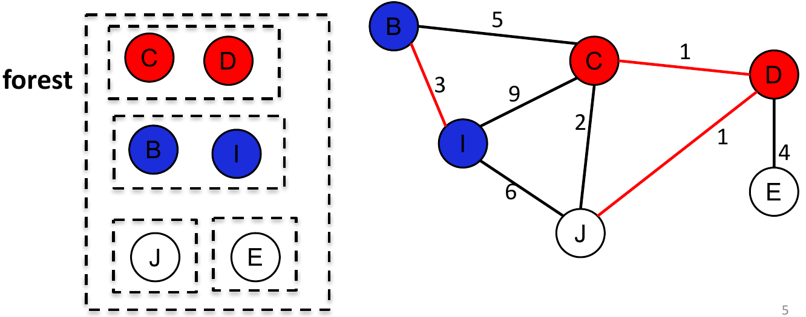

# Disjoint-Sets {#djs}

## Kruskal's Algorithm Revisited

The most time consuming step in Kruskal's algorithm is finding whether two node's are in the same tree (part of the forest) and if not
merging the two tree's together.


<pre><code class="language-java";><b>Given</b> a connected undirected weighted graph G (N nodes, M edges)
Initialize <i>forest</i> as a set of sets, each containing a node from G
Initialize <i>fringe</i> as a priority queue containing all edges in G
Initialize <i>tree</i> as an empty set
<b>Repeat until</b> <i>forest</i> contains one tree or the <i>fringe</i> is empty
  remove the <i>edge</i> from the <i>fringe</i> with the minimum weight
  <span style='color: red;'>if <i>edge.n1</i> and <i>edge.n2</i> are in different trees in <i>forest</i>
    merge the two trees in <i>forest</i>
    add <i>edge</i> to <i>tree</i></span style='color: red;'>
return <i>tree</i>
</code></pre>


### Complexity

Two operations dominate the efficiency of Kruskal's algorithm

* **<span style='color: lightseagreen;'>Find</span>:** Determine whether two elements are in the same *tree* of the *forest*
* **<span style='color: lightseagreen;'>Union</span>:** Merge two trees into one

```{r kruskal, fig.cap="Finding the MST for a graph using Kruskal's algorithm", fig.align='center'}

```

The cost of these two operations depend on the data structure used for the **forest**

#### Option 1: Set of Sets

```{r hashset, fig.cap='Representing the forest with a set of sets.', fig.align='center'}

```

The <span style='color: lightseagreen;'>cost of finding</span> each node in the forest is *O(N)* as you must iterate through each element in the outer set to find the node you're looking for. Similarly <span style='color: lightseagreen;'>cost of merging</span> two trees is *O(N)* as you must add all elements from one set into the other set.

A set of sets e.g. `HashSet<HashSet<Node>>` would be a poor choice as the data structure of the forest.

#### Option 2: Add a Set Id to each Node

```{r set-id, fig.cap='Adding a set id to each node', fig.align='center'}

```

The <span style='color: lightseagreen;'>cost of finding</span> each node in the forest is *O(1)* as you only have to check if the two nodes have the same set Id. However, the <span style='color: lightseagreen;'>cost of merging</span> two trees is still *O(N)* as you must change the set Id of all the nodes in one set to the same Id in the other set.

Adding a identifier to each node is an improvement over a "set of sets" as the data structure of the forest. But, there is an even better data structure to use, the **Disjoint-Set**. 

## Disjoint-Set Data Structure

A <span style='color: lightseagreen;'>disjoint-set</span>, also called a <span style='color: lightseagreen;'>union-find</span> data structure, stores a collection of disjoint/non-overlapping sets. It provides efficient, near *O(1)* operations for finding a member in the set and merging sets.

The most common implementation of a disjoint-set data structure is called a *disjoint-set forest*

```{r disjoint-set, fig.cap='A representation of the disjoint-set forest. The forest is set containing the root nodes of each disjoint-set. Each disjoint set is parent-pointer tree', fig.align='center'}

```

Under this representation a <span style='color: lightseagreen;'>parent pointer tree</span> is used to represent each element in the forest. A parent pointer tree can be thought of as an inverted tree; each node that isn't the root points to its parent node.

* Two nodes are in the same set if and only if the roots of the trees containing the nodes are equal. 
* The <i>forest</i> is the set of the <span style='color: lightseagreen;'>root node</span>** of each parent pointer tree.

### Operations

Disjoint-set data structures support three operations: <span style='color: lightseagreen;'>Making</span>a new set containing a new element, <span style='color: lightseagreen;'>finding</span> the root of the set containing a given element, and <span style='color: lightseagreen;'>merging</span> two sets.

#### MakeSet

The `MakeSet` operation adds a new element. The element is placed into a new set containing only the new element, and the new set is added to the forest.

<pre><b>function</b> <i>MakeSet</i>(<i>x</i>) <b>is</b>
    <b>if</b> <i>x</i> is not already in the forest <b>then</b>
        <i>x</i>.parent&#160;:= <i>x</i>
    <b>end if</b>
<b>end function</b>
</pre>

The `MakeSet` operation has **O(1)** complexity. In particular, initializing a disjoint-set forest with **n** nodes requires **O(n)** time.

```{r makeset, fig.align='center', fig.cap="Initializing a new disjoint-set with element x as the root"}

```

#### Find

The `Find` operation follows the chain of parent pointers from a specific node **x** until it reaches the root element. This root element represents the set to which **x** belongs and may be **x** itself. `Find` returns the root element it reaches.

<pre><b>function</b> <i>Find</i>(<i>x</i>) <b>is</b>
    <b>if</b> <i>x</i>.parent ≠ <i>x</i> <b>then</b>
        <i>root&#160;:= <i>Find</i>(<i>x</i>.parent)    <i>// recursively ascend the tree to its root</i>
        <b>return</b> <i>root</i>
    <b>else</b>    <i>// x is the root</i>
        <b>return</b> <i>x</i>
    <b>end if</b>
<b>end function</b>
</pre>

The time in a `Find` operation is spent chasing parent pointers, so a flatter tree leads to faster `Find` operations.

```{r find, fig.align='center', fig.cap="Find which tree several elements beloing to"}

```


Better performance, can be achieved by updating the parent pointers during a pass to point closer to the root. Because every element visited on the way to the root is part of the same set, this does not change the sets stored in the forest. But it makes future `Find` operations faster.

There are several algorithms for Find that achieve the asymptotically optimal time complexity. One family of algorithms, known as path compression, makes every node between the query node and the root point to the root. Path compression can be implemented using a simple recursion as follows:

<pre><b>function</b> <i>Find</i>(<i>x</i>) <b>is</b>
    <b>if</b> <i>x</i>.parent ≠ <i>x</i> <b>then</b>
        <i>x</i>.parent&#160;:= <i>Find</i>(<i>x</i>.parent)
        <b>return</b> <i>x</i>.parent
    <b>else</b>
        <b>return</b> <i>x</i>
    <b>end if</b>
<b>end function</b>
</pre>

This implementation makes two passes, one up the tree and one back down.

#### Union

The operation `Union(x,y)` merges the two sets containing **x** and the set containing **y** together. `Union` first uses `Find` to determine the roots of the trees containing `x` and `y`:

* If the two roots are the same, there is nothing to do.
* Otherwise, the two trees must be merged. This is done by either setting the parent pointer of **x** to **y** or vice versa.

The choice of which node becomes the parent is consequential. If it is done carelessly, trees can become excessively tall, resulting in decreased performance of future `Find` and `Union` operations.

<pre><b>function</b> <i>Union</i>(<i>x</i>, <i>y</i>) <b>is</b>
    <i>// Replace nodes by roots</i>
    <i>x</i>&#160;:= <i>Find</i>(<i>x</i>)
    <i>y</i>&#160;:= <i>Find</i>(<i>y</i>)
    <b>if</b> <i>x</i> = <i>y</i> <b>then</b>
        <b>return</b>  <i>// x and y are already in the same set</i>
    <b>end if</b>
    <b>else</b>
        <i>x</i>.parent&#160;:= <i>y</i>
        remove <i>x</i> from forest
    <b>end if</b>
<b>end function</b>
</pre>

```{r union, fig.align='center', fig.cap="Merge sets"}

```

In order to ensure the optimal performance, <span style='color: lightseagreen;'>shallower trees should be merged into deeper trees</span>. This requires additional information to be stored in the disjoint-set, the **depth**.

Storing the depth requires, modifying the `MakeSet` operation


<pre><b>function</b> <i>MakeSet</i>(<i>x</i>) <b>is</b>
    <b>if</b> <i>x</i> is not already in the forest <b>then</b>
        <i>x</i>.parent&#160;:= <i>x</i>
        <i>x</i>.depth&#160;:= 0;
    <b>end if</b>
<b>end function</b>
</pre>

The `Union` operation can now make use of the **depth** to merge the shallower tree into the deeper tree.

<pre><b>function</b> <i>Union</i>(<i>x</i>, <i>y</i>) <b>is</b>
    <i>// Replace nodes by roots</i>
    <i>x</i>&#160;:= <i>Find</i>(<i>x</i>)
    <i>y</i>&#160;:= <i>Find</i>(<i>y</i>)
    <b>if</b> <i>x</i> = <i>y</i> <b>then</b>
        <b>return</b>  <i>// x and y are already in the same set</i>
    <b>end if</b>
    <b>else</b>
        <b>if</b> <i>x</i>.depth < <i>y</i>.depth <b>then</b>
            <i>x</i>.parent&#160;:= <i>y</i>
            remove <i>x</i> from forest
        <b>end if</b>
        <b>else</b>
            <i>y</i>.parent&#160;:= <i>x</i>
            remove <i>y</i> from forest
            <b>if</b> <i>x</i>.depth = <i>y</i>.depth <b>then</b>
                <i>x</i>.depth&#160;:= <i>x</i>.depth + 1
            <b>end if</b>
        <b>end if</b>
    <b>end if</b>
<b>end function</b>
</pre>

Using a disjoint-set as the data structure for the forest gives near **O(1)** performance for determining whether two elements belong to the same set and merging two sets into one. This massively improves the performance of Kruskal's algorithm for MST.