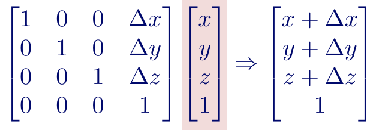

# 3D Rendering {#threed}

## 3D Graphics

3D graphics have many applications, including in movies, games and animations. <span style='color: lightseagreen;'>Rendering</span> is the act of displaying <span style='color: red;'>3D objects</span> on a <span style='color: red;'>2D screen</span>.

```{r 3d-app, fig.cap='Examples of the applications of 3D graphics'}

```


```{r 3d-render, fig.cap='3D object rendered on a 2D screen'}

```

When rendering a 3D object several properties of the object must be considered:

* Shape
* Surface properties
* Material/Mass
* Movement/Animation
* Light sources

Only the visible surface's of a 3D object need to be drawn; any hidden parts can be ignored. This raises two questions:

* How can the <span style='color: lightseagreen;'>visible surfaces</span> be <span style='color: lightseagreen;'>identified</span>
* How can the <span style='color: lightseagreen;'>visible surfaces</span> be <span style='color: lightseagreen;'>rendered</span> on a computer screen.

<span style='color: red;'>Pixels</span> are an elementary unit for representing 2D objects, however they are <span style='color: red;'>not performant</span> enough to be used for representing the surfaces of 3D objects. An alternative <b>rendering unit</b> are <span style='color: lightseagreen;'>polygons</span>. <span style='color: lightseagreen;'>Polygons</span> can use triangles, squares and many other shapes to approximate the surfaces of 3D objects.

```{r polygon-repr, fig.cap='Polygons being used to approximate the surface of a 3D surface. The higher the resolution, the better the image'}

```

## Polygon

A polygon consists of a <span style='color: lightseagreen;'>list of vertices</span>. Each vertex is a <span style='color: lightseagreen;'>point</span> in 3D space. The locations of each of the vertices is represented with a 3D coordinate <span style='color: lightseagreen;'>(<i>x</i>, <i>y</i>, <i>z</i>)</span>

```{r polygon-approx, fig.cap='Polygons being used to approximate the surface of a 3D surface. The higher the resolution, the better the image'}

```

The locations of each vertex is represented with a 3D coordinate <span style='color: lightseagreen;'>(<i>x</i>, <i>y</i>, <i>z</i>)</span>.

### 3D coordinate system

The 3D coordinate system used for rendering 3D objects, uses the right-hand rule to understand the orientation of the three axes in 3D space. For <b>right-handed</b> coordinates the right thumb points along the Z axis in the positive direction and the curl of the fingers represents a motion from the first or X axis to the second or Y axis. When viewed from the top or Z axis the system is counter-clockwise.


For <b>left-handed</b> coordinates the left thumb points along the Z axis in the positive direction and the culrled fingers of the left hand represent a motion from the first or X axis to the second or Y axis. When viewed from the top or Z axis the system is clockwise.

```{r 3d-coords, fig.cap='Left-handed coordinates on the left, right-handed coordinates on the right.'}

```

Under either rule the axes are ordered <i>x</i>, <i>y</i> and <i>z</i>

### 3D transformations

Like their 2D counter-parts transformation of 3D polygons i.e. <span style='color: lightseagreen;'>translation, scaling and rotation</span> requires changing the coordinate of each vertex in the polygon using <span style='color: red;'>linear algebra</span>

```{r 3d-transform, fig.cap='Translation, scaling and rotation'}

```

## Linear Algebra: Basics

There are two basic structures to be considered in linear algebra, are the <b>vector</b> and <b>matrix</b>:

* A <span style='color: lightseagreen;'>vector</span> is a n dimensional list of numbers
* A <span style='color: lightseagreen;'>matrix</span> is an m-row-by-n-column array of numbers

```{r vectors, fig.cap='Scalars, Vectors and Matrices'}

```

A <span style='color: red;'>n-dim</span> <span style='color: lightseagreen;'>vector</span> can be generalised as a <span style='color: red;'>n-row-1-column</span> <span style='color: lightseagreen;'>matrix</span>. So the rules of linear algebra that apply to matrices also apply to vectors.

### Matrix Addition

In order to add two matrices, both matrices must have the same dimensions (same number of rows and columns). If this condition is met, then matrix addition consists of adding the element in one matrix to the corresponding element in the other matrix.

```{r matrix-addition, fig.cap='Add the elements in one matrix to the corresponding elements in the other matrix'}

```

### Matrix Multiplication

The <b>condition</b> for multiplying two matrices, is that the number of columns in matrix 1, must be the same as the number of rows in matrix 2.

* Matrix 1: <span style='color: red;'>m</span>-row x <span style='color: green;'>n</span>-col
* Matrix 2: <span style='color: green;'>n</span>-row x <span style='color: yellow;'>k</span>-col

To calculate element (<i>i</i>, <i>j</i>) of the resulting matrix, multiply row <i>i</i> in matrix 1 by column <i>j</i> in matrix 2.

```{r matrix-mult1, fig.cap='Get row i from matrix 1 and column j from matrix 2'}

```

And take the inner product of two vectors with the same dimension.

```{r matrix-inner, fig.cap='Calculate the inner product of row i and column j'}

```

Repeat this for every row in matrix 1 and column in matrix 2. The resulting matrix will have <span style='color: red;'>m</span>-rows and <span style='color: yellow;'>k</span>-columns.

* (<span style='color: red;'>m</span>-row-<span style='color: green;'>n</span>-col) x <span style='color: green;'>n</span>-row-<span style='color: yellow;'>k</span>-col → (<span style='color: red;'>m</span>-row-<span style='color: yellow;'>k</span>-col).

```{r matrix-mult, fig.cap='Matrix multiplication'}

```

Matrix multiplication and addition are both associate (as with scalars), this means you could multiply the matrices of multiple transformations to form one resultant matrix that can be directly applied on a point.

This is one reason GPUs are optimized for fast matrix multiplications. In computer graphics, we need to apply lots of transformations to out #D object to display it on a 2D monitor. Those transforms are compiled down into one matrix which is applied to all the points in the 3D world.

## 3D Transformations

### Translation

Translating a 3D vector or matrix is simply an application of matrix addition. To translate point (<i>x</i>, <i>y</i>, <i>z</i>) by
(<i>&Deltax</i>, <i>&Deltay</i>, <i>&Deltaz</i>)

```{r 3d-translation, fig.cap='3D Translation'}

```

### Scaling

Scaling a 3D matrix is an application of matrix multiplication. To scale (<i>x</i>, <i>y</i>, <i>z</i>) by scaling factors (<i>S<sub>x</sub></i>, <i>S<sub>y</sub></i>, <i>S<sub>z</sub></i>), multiply the point vector by the scale matrix, <b><i>S</i></b>.

```{r 3d-scaling, fig.cap='3D Scaling'}

```

Prior to scaling the 3D point must be translated so that its center lies on the origin, and then appy the reverse translation after scaling.

### Rotation

Rotation is a complicated scenario for 3D transforms. Here, you need an axis around which you rotate the object.
Before generalizing the rotation for any axis, let’s do it around the x, y, and z-axes. After doing it with one axis, the other two will become fairly easy.

* <b><span style='color: red;'>x-axis</span></b>: Here imagine the <i>y-z</i> plane is your screen monitor, <span style='color: lightseagreen;'>x-axis</span> rotate anti-clockwise about the angle <i>&theta</i>,keeping <i>x</i> fixed</span>.

```{r 3d-rotation1, fig.cap='3D Rotation in the y-z plane'}

```

* <b><span style='color: red;'>y-axis</span></b>: Here imagine the <i>x-z</i> plane is your screen monitor, <span style='color: lightseagreen;'>x-axis</span> rotate anti-clockwise about the angle <i>&theta</i>,keeping <i>y</i> fixed</span>.

```{r 3d-rotation2, fig.cap='3D Rotation in the x-z plane'}
knitr::include_graphics("img/08-image15.png")
```

* <b><span style='color: red;'>z-axis</span></b>: Here imagine the <i>x-y</i> plane is your screen monitor, <span style='color: lightseagreen;'>x-axis</span> rotate anti-clockwise about the angle <i>&theta</i>,keeping <i>z</i> fixed</span>.

```{r 3d-rotation3, fig.cap='3D Rotation in the x-y plane'}

```

The below three figures summarise rotation about the three axes.

```{r 3d-rotation4, fig.cap='3D Rotation summarised'}

```

## Unified Transformation Operator

Each of translation, scaling and rotation involved a different matrix operation.

* <b>Translation</b>: add a vector
* <b>Scaling</b>: multiply by a matrix on the left
* <b>Rotation</b>: multiply by a matrix on the left

Having a <span style='color: lightseagreen;'>unified transformation operator</span> would significantly simplify 3D transformation. This would give a single method/function for all transformation scenario's. To achieve this, translation needs to be redefined as a matrix multiplication (on the left).

In order to achieve this the point (<i>x</i>, <i>y</i>, <i>z</i>), needs an extra dimension.

```{r trans-unified-op, fig.cap='Translation of a 3D point by matrix mulitplication. The translation matrix has 1s all along the diagonal the <i>&Delta</i>s are down the final column and all other entries are 0.'}

```


The other two transformations can also be redefined with the additional dimension.

* Scaling

```{r scaling-unified-op, fig.cap='Scaling matrix. The top-left corner is the original 3x3 matrix with 1 as the final diagonal element and all other entries are zero'}

```


* Rotation

```{r rotate-unified-op, fig.cap='Rotation matrices. The top-left cornet is the original 3x3 matrix with 1 as the final diagonal element and all other entries are zero'}

```

```{r rotate-unified-x, fig.cap='Rotation transformation about the x-axis'}

```


### Pseudocode

<pre><b>function</b> <i>Transform</i>(<i>point</i>, <i>transform_m</i>) <b>is</b>
    <i>// point is length three vector {x, y, z}</i>
    <i>// transform_m is a 4x4 matrix</i>
    <i>n_point</i>&#160;:= {0, 0, 0, 1}
    <i>// multiply (x, y, z, 1) with the 4x4 transform_m on the left</i>
    <b>for</b> <i>i</i>&#160;:= 0..<i>n_point</i>.length
        <b>for</b> <i>j</i>&#160;:= 0..<i>n_point</i>.length
            <i>n_point</i>[<i>i</i>]&#160;:= <i>n_point</i>[<i>i</i>] + <i>transform_m</i>[<i>i</i>][<i>j</i>] * <i>point</i>[<i>i</i>]
        <b>end for</b>
    <b>end for</b>
    <i>// only keep the first 3 elements</i>
    <i>n_point</i>&#160;:=<i>n_point</i>[0:2]
    <b>return</b> <i>n_point</i>
<b>end function</b>
</pre>

## Composite Transformations

So far we've seen how to do a <span style='color: lightseagreen;'>single transformation</span> (translation, scaling, rotation) using unified the unified transformation operator, but what if we apply <span style='color: lightseagreen;'>multiple transformations</span>?

* <span style='color: lightseagreen;'>translation + scaling or translation + rotation</span>

This type of operation can be achieved with <span style='color: lightseagreen;'>composite matrix multiplication</span>

```{r composite-mult, fig.cap='Translation and rotation as composite matrix multiplication'}

```

Matrix transformations should be applied from right to left i.e. first transformation to the right most matrix and last to the left most matrix

<pre><b>function</b> <i>CompositeMatrix</i>(<i>matrices</i>) <b>is</b>
    <i>// input is a sequence of 4x4 transformation matrices {m1, ..., mk}</i>
    <i>// returns the 4x4 composite transformation matrix</i>
    <i>composite_matrix</i>&#160;:= <i>matrices</i>[0] * <i>matrices</i>[1]
    <b>for</b> <i>i</i>&#160;:= 2..<i>matrices</i>.length
        <i>composite_matrix</i>&#160;:= <i>matrices</i>[i] * <i>composite_matrix</i>
    <b>end for</b>
    <b>return</b> <i>composite_matrix</i>
<b>end function</b>
</pre>

The prioritisation of transformation operations is:

1. Translation
2. Scaling
3. Rotation

## Drawing Polygons

Only the visible <span style='color: lightseagreen;'>surfaces</span> of a polygon should be drawn. How, can you find out which surfaces are visible?

* Use 3D coordinate system + cross product

This method assumes the <span style='color: lightseagreen;'>viewer looks along the <i>z</i>-axis</span> and the polygons vertices are <span style='color: lightseagreen;'>ordered anti-clockwise from the perspective of the viewer</span>.

```{r draw-polygon, fig.cap='The z-axis faces the viewer (blue plane), the vertices are ordered anti-clockwise'}

```

### Cross Product

The <b>cross product</b> is an operation applied to two vectors of the same dimension. It returns a new vector that is <span style='color: lightseagreen;'>perpendicular</span> to the two input vectors

```{r cross-prod, fig.cap='Cross product'}

```

The orientation of the three vectors follow the <span style='color: lightseagreen;'>right-hand rule</span>

```{r rhr, fig.cap='Right-hand rule orientation of the three vectors'}

```

And the cross product can be used to determine which direction the polygon is facing.

* the vertices <b>v<sub>1</sub></b>, <b>v<sub>2</sub></b>, <b>v<sub>3</sub></b>
* the cross product vector <b>(v<sub>1</sub> - v<sub>2</sub>) x (v<sub>3</sub> - v<sub>2</sub>)</b> faces the viewer

```{r cross-prod-vec, fig.cap='Orientation of the cross product relative to the three vertices'}

```

### Determining Visible/Invisible Polygons

The cross product <span style='color: lightseagreen;'><b>(v<sub>1</sub> - v<sub>2</sub>) x (v<sub>3</sub> - v<sub>2</sub>)</b></span> is called the <b>normal</b> of the polygon. A normal is a line that is perpendicular to the surface of the polygon and the direction of the normal is used to determine whether the polygon surface is visible.

```{r normal, fig.cap='The green lines are the normals of the polygon'}

```

Assuming that the polygon is being viewed along the <span style='color: lightseagreen;'>z-axis</span>:

* A polygon is <span style='color: lightseagreen;'>visible</span> if its <span style='color: lightseagreen;'>normal has negative z-coordinate values</span>
* A polygon is <span style='color: lightseagreen;'>invisible</span> if its <span style='color: lightseagreen;'>normal has non-negative z-coordinate values</span>

## Shading

Shading refers to the light that is reflected off of the surfaces of objects. In 3D graphics shading is the process of altering the colour of the surfaces of visible polygons, dependent on

* Direction and colour of light sources
* Reflectance
* Matte/Shiny surface
* Colour, texture of the surface

A simple method to calculate the shading is:

* Assume a matte, <span style='color: lightseagreen;'>uniform reflectance</span> for red, green and blue colours
* Assume some <span style='color: lightseagreen;'>ambient light</span> in the range (0,1]. Ambient light is omnidirectional and all surfaces equally
* Assume an incident <span style='color: lightseagreen;'>light source</span> intensity (0, 1], and its direction
* Diffuse reflection depends on the direction of the incident light source
  * <span style='color: lightseagreen;'>incident light = incident light intensity * reflectance * cos(&theta)</span>
* <span style='color: lightseagreen;'>light = ambient light + incident light</span>


```{r cos-theta, fig.cap='The calculation of cos theta is based on the law of cosines'}

```

### Algorithm

```{r shading, fig.cap='Algorithm to calculate the shading of 3D polygons'}

```

## Advanced Shading


### Flat shading

Here the light reflected from the polygon surface is span style='color: lightseagreen;'>uniform</span>, based on the assumption that the polygons surface is flat. The color is computed from the polygon's surface normal and is used for the whole polygon so it only needs to be calculated once, and makes the corners look sharp and contrast

```{r flat-shading, fig.cap='Flat shading of a cuboid'}

```


### Smooth shading

In contrast to flat shading where the colours change discontinuously at polygon borders, with smooth shading the color changes from pixel to pixel (across the surface), resulting in a smooth color transition between two adjacent polygons and the surface <span style='color: lightseagreen;'>approximates a curved surface</span>


this situation the reflected light can be interpolated from the polygon vertices by using "vertex normals" (<span style='color: lightseagreen;'>average of the surface at the vertex)</span>:
Usually pixel values are first calculated in the vertices and interpolation is used to calculate the values of pixels between the polygon vertices. Types of smooth shading include <span style='color: lightseagreen;'>Gourard shading</span> and <span style='color: lightseagreen;'>Phong shading</span>

<b>Gourard shading</b>

1. Determine the normal at each polygon vertex and calculate the light intensity from the vertex normal
2. <span style='color: lightseagreen;'>Interpolate the light intensities</span> over the surface of the polygon.

 <b>Phong shading</b>
 
Phong shading is similar to Gouraud shading, except that instead of interpolating the light intensities the normals are interpolated between the vertices and the lighting is evaluated per-pixel
 
 1. Determine the normal at each vertex of the polygon
 2. <span style='color: lightseagreen;'>Interpolate the normal at each pixel</span>
 3. Calculate the light intensity from the computed normals across the surface of the polygon


## Polygon Rendering

To Render a <span style='color: lightseagreen;'>visible polygons</span> you need to compute its <span style='color: lightseagreen;'>shading colour</span> and <span style='color: red;'>render</span> the polygon with its shading colour. Polygon rendering involves drawing a <b>3D</b> polygon on a <b>2D</b> screen.

```{r polygon-render, fig.cap='Rendering a 3D shape on a 2D screen'}

```

To do this, set the z-axis of the polygon as the viewing direction, meaning the display screen is the x-y plane of the polygon. Polygons are rendered <span style='color: lightseagreen;'>line-by-line</span>.

<pre>
    <b>for</b> <i>y</i>&#160;:= <i>y_min</i>..<i>y_max</i>
        <b>for</b> <i>x</i>&#160;:= <i>x_min</i>[<i>y</i>]..<i>x_min</i>[<i>y</i>]
            <i>pixel</i>[<i>x</i>][<i>y</i>]&#160;:= <i>shading_color</i>(<i>polygon</i>)
        <b>end for</b>
    <b>end for</b>
</pre>

```{r polygon-render2, fig.cap='Diagramatic Rendering a 3D shape on a 2D screen'}
knitr::include_graphics("img/08-image32.png")
```

It is reasonably straight forward to obtain the y<sub>min</sub> and y<sub>max</sub>.

* y<sub>min</sub> = v<sub>3</sub>.y
* y<sub>min</sub> = v<sub>2</sub>.y

How can you get x<sub>min</sub>(y) and x<sub>min</sub>(y)? For any y-value, the x<sub>min</sub>(y) and x<sub>min</sub>(y) are on the edges of the polygon, assuming the edges are scanned in an <span style='color: lightseagreen;'>anti-clockwise</span> direction:

* When you are scanning downwards (in the y direction) - x<sub>min</sub>(y)
* When you are scanning upwards (in the y direction) - x<sub>max</sub>(y)

### Linear Interpolation

Given the two end-nodes of an edge (x<sub>1</sub>, y<sub>1</sub>) and (x<sub>2</sub>, y<sub>2</sub>), what is the x value of the given y value along the edge?

* Along the two edges, y changes from y<sub>1</sub> to y<sub>2</sub> and x changes from x<sub>1</sub> to x<sub>2</sub>
* For each unit change of y, x will change x<sub>2</sub> - x<sub>1</sub> / y<sub>2</sub> - y<sub>1</sub> (<span style='color: red;'><i>slope</i></span>)

* <span style='color: lightseagreen;'><i>x</i>(<i>y</i>) = <i>x<sub>1</sub></i> + <i>slope</i> * (<i>y</i> - <i>y<sub>1</sub></i>)</span>

```{r linear-interp, fig.cap='Using linear interpolation to compute the x coordinate from two edges and a given y value'}

```

This is repeated to compute the x values for <b>all</b> y values along the edge and the results stored in a list.

<pre>
    <i>slope</i>&#160;:= (<i>x2</i> - <i>x1</i>) / (<i>y2</i> - <i>y1</i>)
    <i>x</i>&#160;:= <i>x1</i>    <i> // x is a list that stores all x's for a given y.
    <b>for</b> <i>y</i>&#160;:= <i>y1</i>..<i>y2</i>
        <i>xs</i>[<i>y</i>]&#160;:= <i>x</i>
        <i>x</i>&#160;:= <i>x</i> + <i>slope</i>
    <b>end for</b>
</pre>

Repeating this and scanning the three edges of the polygon will get the two lists  x<sub>min</sub>(y) and x<sub>max</sub>(y)

### Edge List

Scan the three edges in the polygon, and update a 2-column `EdgeList` object. This object will store the x<sub>min</sub> and x<sub>max</sub> for a given y-coordinate.

* If scanning <b>upwards</b> (along the y-axis), then update the <b>x<sub>min</sub>(y)</b> column
* If scanning <b>downwards</b> (along the y-axis), then update the <b>x<sub>max</sub>(y)</b> column
* Use linear interpolation to calculate the x value along each edge

```{r edgelist, fig.cap='Structure of the EdgeList object which holds the min and max x-values for a given y value'}

```

<pre><b>function</b> <i>compute_edgelist</i>(<i>vs</i>) <b>is</b>
    <i>// vs are the vertices in the polygon </i>
    <i>// where the z-axis is orientated towards the viewer</i>
    <i>edges</i>&#160;:={(<i>vs</i>.v1, (<i>vs</i>.v2), ((<i>vs</i>.v2, (<i>vs</i>.v3), ((<i>vs</i>.v3, (<i>vs</i>.v1)}
    <i>// a and b are a polygon edge</i>
    <i>// the polygon is traversed in anti-clockwise order v1, v2, v3 </i>
    <b>for</b> (<i>a</i>,<i>b</i>) in <i>edges</i>
        <i>slope</i>&#160;:= (<i>b</i>.x - <i>a</i>.x) / (<i>b</i>.y - <i>a</i>.y)
        <i>x</i>&#160;:= <i>a</i>.x
        <i>y</i>&#160;:= <b>round</b>(<i>a</i>.y)
        <b>if</b> <i>a</i>.y < <i>b</i>.y         <i>// going down, update x_min[y] </i>
            <b>while</b> (<i>y</i> <= <i>b</i>.y )
                <i>x_min</i>[y]&#160;:= <i>x</i>
                <i>x</i>&#160;:= <i>x</i> + <i>slope</i>
                <i>y</i>&#160;:= <i>y</i> + 1
            <b>end while</b>
        <b>end if</b>
        <b>else</b>               <i>// going up, update x_max[y]
            <b>while</b> (<i>y</i> >= <i>b</i>.y )
                <i>x_max</i>[y]&#160;:= <i>x</i>
                <i>x</i>&#160;:= <i>x</i> - <i>slope</i>
                <i>y</i>&#160;:= <i>y</i> - 1
            <b>end while</b>
        <b>end if</b>
    <b>end for</b>
    <b>return</b> <i>EdgeList</i>(<i>x_min</i>, <i>x_max</i>)
<b>end function</b>
</pre>


### Multiple polygons

What happens if two polygons intersect i.e. one polygon is in front of the other? In this case only the pixels of the closer polygon need to be rendered (lower z-coordinate), to do this the z-coordinate for each pixel needs to be worked out.

The `EdgeList` object must now store additional information, to retrieve the z-coordinate for a given x and y.

* x<sub>min</sub>(y) for the polygon edge
* x<sub>max</sub>(y) for the polygon edge
* <b>z[x, y]</b> for every pixel

If a pixel occurs on multiple polygons only render the polygon where it has the smallest z value.

### Render with Edge List and Z-Buffer

Compute the `EdgeList` for the x and z coordinates for the vertices on the polygon edges

* Compute the z value of a pixel inside the polygon using another linear interpolation

```{r z-value, fig.cap='Interpolate the z coordinate for each pixel using linear interpolation'}

```

#### Pseudocode

<pre><b>function</b> <i>render_polygon</i>(<i>polygons</i>, <i>width</i>, <i>height</i>) <b>is</b>
    <i>// input polygons is a list of polygons</i>
    <i>// input width is the image width</i>
    <i>// input height is the image height</i>
    <i>// returns the 2x2 matrix of rendering colors </i>
    <i>rendered</i>&#160;:= <b>matrix</b>(<i>cols</i>=<i>width</i>, <i>rows</i>=<i>height</i>)
    <i>z_depth</i>&#160;:= <b>matrix</b>(<i>cols</i>=<i>width</i>, <i>rows</i>=<i>height</i>)
    <b>for</b> <i>polygon</i> in <i>polygons</i>
    <i>// calculate the x and z EdgeList (el) for this polygon </i>
        <i>el</i>&#160;:= <i>compute_edgelist</i>(<i>polygon</i>)
        <b>for</b> <i>y</i>&#160;:= <i>el</i>.ymin..<i>el</i>.ymax
            <i>slope</i>&#160;:= (<i>el</i>.zr[<i>y</i>] - <i>el</i>.zl[<i>y</i>]) / (<i>el</i>.xr[<i>y</i>] - <i>el</i>.xl[<i>y</i>])
            <i>x</i>&#160;:= <i>round</i>(<i>el</i>.xl[<i>y</i>])
            <i>z</i>&#160;:= <i>el</i>.zl[<i>y</i>] + <i>slope</i> * (<i>x</i> - <i>el</i>.xl[<i>y</i>])
            <b>while</b> x <= <b>round</b>(<i>el</i>.xr[<i>y</i>])
                <b>if</b> <i>z</i> < <i>z_depth[<i>x</i>,<i>y</i>]</i>
                    <i>rendered</i>[<i>x</i>, <i>y</i>]&#160;:= <b>compute_color</b>(<i>polygon</i>)
                    <i>z_depth</i>[<i>x</i>, <i>y</i>]&#160;:= <i>z</i>
                    <i>x</i>&#160;:= <i>x</i> + 1
                <b>end if</b>
            <b>end while</b>
        <b>end for</b>    
    <b>end for</b>
    <b>return</b> <i>rendered</i>
<b>end function</b>
</pre>