# Parsing {#parse}

## Structured Text

What makes the following texts structured?

* SQL schema query

```sql
DELETE FROM DomesticStudents2018
WHERE grade = 'E'
```

* Java statement

```java
while (A[i] != x) {
  k++;
}
```

* XML documents

```xml
<html><head><title>My Web Page</title></head>
<body><p> Thanks for viewing </p></body></html>
```

Text is <b>structured</b> if it can be described using a <b>grammar</b>. A grammar consists of  <i>a set of rules</i>:

* The rules describe how to form strings from the language's alphabet that are valid according to <i>the language's syntax</i>
* However, a grammar does not describe the meaning of the strings or what can be done with them in whatever context - only their <i>form</i>.

## Defining a Grammar

<b>A grammar is a finite description of a possible infinite set of acceptable sentences</b>. One of the simplest existing grammars are <b>regular expressions</b> (regex).


### Representing a Language Through Regex

An example language defined only using regex consists of the following rules:

1. Words can only consist of the letters a & b
2. the letter a cannot follow the letter b

These rules mean the following strings are <b><span style='color: lightseagreen;'>legal</span></b>: a, ab, aaa, aab, aaaaaabbbbbbb, b, bbb, ...  
While these strings are <b><span style='color: lightseagreen;'>illegal</span></b>: ba, aba, abba, bbbbbbaaaaa

A very condensed way of representing the above rule is through the following <b>regex</b> `a*b*`. The regex is finite even though the set of legal values can be infinite. 

Rather than defining grammars regex is more commonly used in pattern matching. See the below table:

```{r regex-patterns}
patterns <- c("abc", 
              "a|e|i|i|u",
              ".",
              "[0-9]",
              "[a-z]",
              "\\\\d",
              "\\\\w",
              "*",
              "+",
              "?")
meaning <- c("Matches 'abc'",
             "Matches one of a, e, i, o, u",
             "Metacharater, meaning any character",
             "Numerals",
             "Letters (lowercase)",
             "Digit",
             "Whitespace", 
             "Any number of",
             "At least one of",
             "Optional")
regex <- data.frame(Pattern=patterns, Meaning=meaning)
knitr::kable(
  regex, 
  caption = "A subset of regex patterns and their meanings",
  booktabs = TRUE
)
```

There are numerous online resources for learning about regex:

* [Regex One](https://regexone.com/)
* [Regex grammar](http://web.mit.edu/6.005/www/fa16/classes/17-regex-grammars/)
* [Java](https://regexone.com/references/java)

#### Regular Expressions in Java

In Java, to perform the pattern matching on an input string, The Java compiler, `javac` turns the regex into a <b>finite state machine</b>, known as an <i>Acceptor</i>. A graph data structure can be used to represent FSM where the nodes correspond to states and the edges to transitions in the FSM. Creating this graph is a complex and computationally expensive process^[Here is a link to a video explaining the [process](https://www.youtube.com/watch?v=GwsU2LPs85U)].


Pattern matching on a string can be performed in the following way in Java:

```java
import java.util.regex.*;

boolean b = Pattern.matches("a*b", "aaaaaab");
```

This combines the generation of the FSM (first argument) and its use on the particular string (second argument). Building the FSM graph^[Through Thompson's construction algorithm] is expensive. So if you need to match the same pattern of many strings it's better to construct the pattern instance and match it to a string in the following way:

```java
Pattern p = Pattern.compile("a*b");
Matcher m = p.matcher("aaaaaab");
boolean b = matches();
```

The same pattern instance can be reused on multiple strings in the following way:

```java
for (var input : inputs) {
  System.out.println(p.matcher(input).matches);
}
```

#### Examples of the Acceptor graph

```{r acceptor1, fig.cap="The Acceptor graph for patterns like a+b+ and aa*bb*", out.width='60%', out.height='60%'}
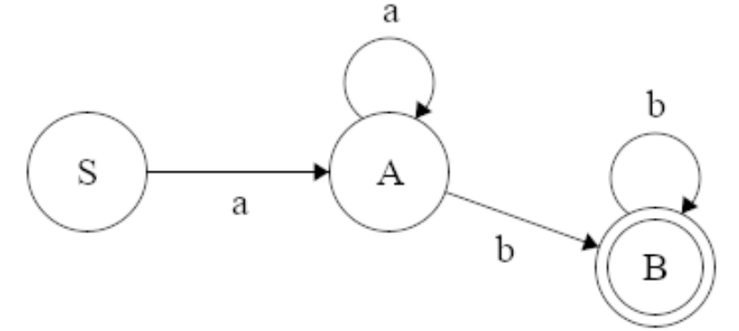
```

Node <b><i>S</i></b> represents the starting state and the double circle in the final node int the above to graph represents the accepting state. The `*` and `+` meta-characters are represented by the two looping edges.

```{r acceptor2, fig.cap="The Acceptor graph for patterns like a*b+ and a+|b+", out.width='60%', out.height='60%'}
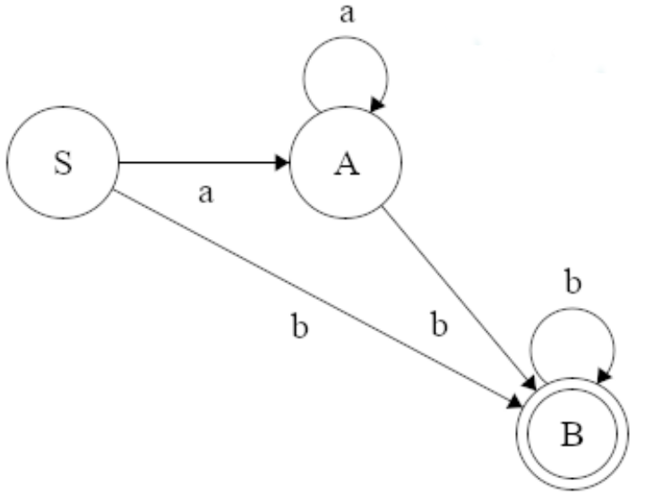
```

The two edges from Node <b><i>S</i></b> indicates that Node <b><i>A</i></b> is optional.

### Representing a Language Through a Grammar

A grammar describes how to form strings from a language's alphabet that are valid according to the language's syntax. A grammar does not describe the meaning of the strings or what can be done with them in whatever context - <b>only their form</b>.

A formal grammar is a set of rules for rewriting strings, along with a <b>start symbol</b> from which the rewriting starts.

For example assume the alphabet consists of the letters <i>a</i> and <i>b</i>, the start symbol is <b><i>S</i></b>, and we have the following rules^[this is the same as the regex a+b+]:

1. <b><i>S</i></b> -> a<b><i>A</i></b>
2. <b><i>A</i></b> -> a<b><i>A</i></b> | b<b><i>B</i></b>
3. <b><i>B</i></b> -> b<b><i>B</i></b> | end

Given we start with <b><i>S</i></b>, we can apply rule 1 to it, replacing <b><i>S</i></b> and obtaining the string a<b><i>A</i></b>. Afterwards we can only apply rule 2 to the resultant string; rule 2 consists of two choices to, we can replace <b><i>A</i></b> with a<b><i>A</i></b> or with b<b><i>B</i></b>. If we take the second choice, we obtain ab<b><i>B</i></b>. From this point we can then choose to either finish or reapply b<b><i>B</i></b> to the string. If the first choice is selected then the final string is ab.

## Context-Free Grammar

The rules in a grammar are made up of two kinds of symbols, <b>terminals</b> and <b>nonterminals</b>. Terminals are also known as <b>tokens</b>; they are literal strings or characters and are not defined as part of the rules of the grammars. <b>Nontermimals</b> are elements of the grammar that are not part of the text and are defined by the rules of the grammar.

A simple html grammar:


<span style='color: green;'>HTMLFILE</span> ::= "<span style='color: blue;'>&lt;html&gt;</span>" [<span style='color: green;'>HEAD</span>] <span style='color: green;'>BODY</span> "<span style='color: blue;'>&lt;/html&gt;</span>"  
<span style='color: green;'>HEAD</span> ::= "<span style='color: blue;'>&lt;head&gt;</span>" <span style='color: green;'>TITLE</span> "<span style='color: blue;'>&lt;/head&gt;</span>"  
<span style='color: green;'>TITLE</span> ::= "<span style='color: blue;'>&lt;title&gt;</span>" <span style='color: green;'>TEXT</span> "<span style='color: blue;'>&lt;/title&gt;</span>"  
<span style='color: green;'>BODY</span> ::= "<span style='color: blue;'>&lt;body&gt;</span>" [<span style='color: green;'>BODYTAG</span>]* "<span style='color: blue;'>&lt;/body&gt;</span>"  
<span style='color: green;'>BODYTAG</span> ::= <span style='color: green;'>H1TAG</span> | <span style='color: green;'>PTAG</span> | <span style='color: green;'>OLTAG</span> | <span style='color: green;'>ULTAG</span>  
<span style='color: green;'>H1TAG</span> ::= "<span style='color: blue;'>&lt;h1&gt;</span>" <span style='color: green;'>TEXT</span> "<span style='color: blue;'>&lt;/h1&gt;</span>"  
<span style='color: green;'>PTAG</span> ::= "<span style='color: blue;'>&lt;p&gt;" <span style='color: green;'>TEXT</span> "<span style='color: blue;'>&lt;/p&gt;</span>"  
<span style='color: green;'>OLTAG</span> ::= "<span style='color: blue;'>&lt;ol&gt;</span>" [<span style='color: green;'>LITAG</span>]+ "<span style='color: blue;'>&lt;/ol&gt;</span>"  
<span style='color: green;'>ULTAG</span> ::= "<span style='color: blue;'>&lt;ul&gt;</span>" [<span style='color: green;'>LITAG</span>]+ "<span style='color: blue;'>&lt;/ul&gt;</span>"  
<span style='color: green;'>LITAG</span> ::= "<span style='color: blue;'>&lt;li&gt;</span>" <span style='color: green;'>TEXT</span> "<span style='color: blue;'>&lt;/li&gt;</span>"  
<span style='color: green;'>TEXT</span> ::= <i>sequence of characters other than < and ></i>  

In the above example the terminal strings or tokens are in <span style='color: blue;'>blue</span> and the <span style='color: green;'>nonterminals</span> are highlighted in <span style='color: green;'>green</span>. The <span style='color: green;'>HTMLFILE</span> is the top level/starting nonterminal (usually defined first in a grammar). Just like in regex special meta-characters are used to define the grammar:

```{r html-grammar}
metacharacter <- c("|", 
                  "[NT\\]",
                  "[NT]*",
                  "[NT]+")
meaning <- c("Or",
             "Optional",
             "Any number of times",
             "More than once")
regex <- data.frame("Meta-character"=metacharacter, Meaning=meaning)
knitr::kable(
  regex,
  booktabs = TRUE
)
```

### Parsing Text from Raw Input

Given some raw text and a grammar the following prerequisite must be met before the text can be <b>parsed</b>:

* The text needs to be broken into a sequence of tokens. This is termed <span style='color: lightseagreen;'>lexing</span>

The grammar can then be used to parse the token sequence. Parsing could mean one of two things:

1. Validating the text against the grammar rules
2. Constructing the <b>parse tree</b> for the text

#### Breaking inputs into tokens

A simple approach to breaking the input into tokens involves defining a delimiter that can be used to split the text into the tokens. In java the `Scanner` class can be supplied with a delimiter to break the sequence of characters up; the delimiter can be a Java regular expression or something simple as the whitespace character (which couldn't be used to separate the tokens out in html). Text that matches to the delimiter will <b>not be returned in tokens</b>

```java
public parse(String input) {
  String delimiter = "\\s*(?=<)|(?<=>)\\s*";
  Scanner s = new Scanner(input)
    .useDelimiter(delimiter)
  if (parseExpr(s)) 
    System.out.println("Valid Expression")
}
```
The above delimiter `\\s*(?=<)|(?<=>)\\s` is a complicate regex (the details are not examinable) and is compatible with the HTML grammar. 

* Spaces are separator characters that are not part of the tokens, and the delimiter excludes them. The spaces are used to separate the terminals
* Tokens are also delimited at the `<` and `>` characters, but these remain as tokens.

Given:

```html
<html><head><title> Something </title></head>
<body> <h1> My Header </h1>
<ul><li> Item 1 </li><li> Item 42 </li></ul>
<p> Something really important </p>
</body>
</html>
```
The previously defined `Scanner` object would separate this input into the following tokens:

```
<html>
<head>
<title> 
Something 
</title>
</head>
<body>
<h1>
My
Header
</h1>
<ul>
<li> 
Item 
1 
</li>
<li>
Item 
42 
</li>
</ul>
<p> 
Something 
really 
important 
</p>
</body>
</html>
```

Defining delimiters can be very tricky, some languages are straightforward e.g. Lisp, HTML, XML as they are designed to be so. Rather than defining a pattern to match to the <i>separators</i> lexing can be easier if you define a pattern to match to the <i>tokens</i>

* Make a method that will search for and return the next token. based on the token pattern
* The pattern is made from the combination of patterns for each kind of token
* The patterns can be regular expressions
  * Use an Acceptor automaton to match / recognize them
  
There are a number of existing tools for lexing [easier](http://en.wikipedia.org/wiki/Lexical_analysis). Now lets use the lexer and grammar to parse the following:
 
```html
<html><head><title>Today</title></head>
<body> <h1>My Day</h1>
<ul><li>meeting</li><li>lecture</li></ul>
<p>parsing stuff</p>
</body>
</html>
```

Is the above input a valid piece of HTML - does it conform to the grammar rules. What is the structure needed to analyse the input and answer the question:
 
* What are the components
* What types are the components
* How are they related

## Parse Trees
 
Text that conforms to the simple HTML grammar has a tree structure (nonterminals are defined hierarchically). 
 
* The tree is <b>ordered</b> as the <b>order of the children is significant</b>
* Each node in the tree and its children correspond to a grammar rule
* Each internal node is labeled by the nonterminal on the LHS of the rule
* Leaf nodes correspond to terminals
 
A <b><span style='color: lightseagreen;'>concrete parse tree</span></b> represents the syntactic structure of input string according to the formal grammar, showing all components of the rules.
 
```{r parse-tree, fig.cap="A concrete parse tree of an input string", out.width='60%', out.height='60%'}
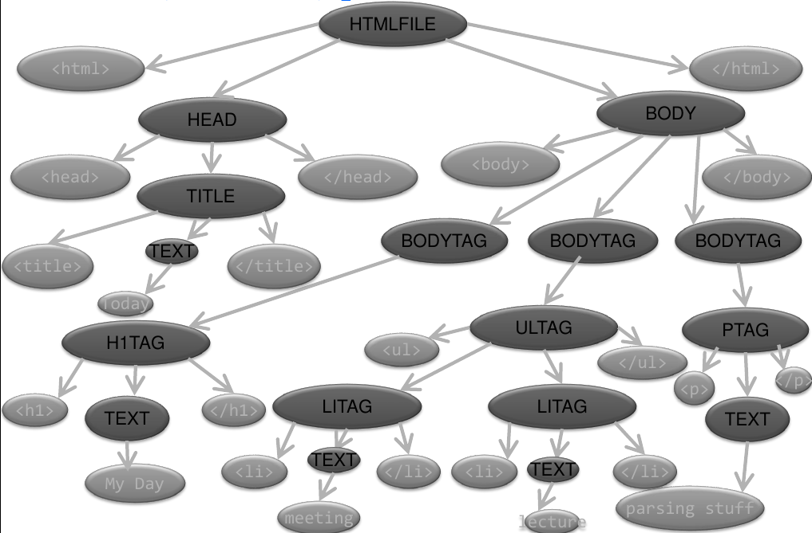
```


Concrete parse trees are very dense and contain lots of information. However not all of that information is meaningful or necessary. For example we know from the grammar rules that every `HEAD` nonterminal will contain the "&lt;head&gt;" and "&lt;/head&gt;" terminals, we only care what `TITLE` there is as this is the only unknown/variable component.


An <b><span style='color: lightseagreen;'>abstract syntax tree (AST)</span></b> is a tree representation of the abstract syntactic structure of the text. The syntax in the AST is 'abstract' in that it does not represent everything in the full syntax. 

* It doesn't contain elements of the rules that are not essential to the structure

```{r syntax-tree, fig.cap="An abstract syntax tree of the input string. It excludes the already known terminals", out.width='60%', out.height='60%'}
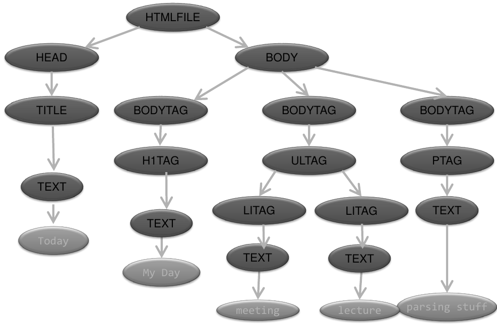
```

### Implementation

The process of getting from the input string to the parse tree consists of two steps:

1. <b>Lexing</b> -> Separating the sequence of characters into tokens.
2. <b>Parsing</b> -> Transforming the sequence of tokens into a AST

We know the lexing step can done through the `Scanner` class and regex. While parsing can be accomplished through recursion.

#### Top Down Resursive Descent Parser

A recursive descent parser generally consist of a set of recursive functions (or methods) each corresponding to a specific nonterminal. The job of the specific method is to read in all tokens for that nonterminal.  
In order to do that the parser must be able to decide which nonterminal the token corresponds to. The parser should return an exception if the token is missing or does not match to any allowable tokens and this requires the grammar rules to be highly constrained i.e. <span style='color: red;'> always able to choose the next path given the current state and the next token</span>

* Naive Top Down Recursive Descent Parser
  * Have a method corresponding to each nonterminal rule that calls other nonterminal methods for each nonterminal token and calls a scanner for each terminal token

For example using the grammar:

```
FOO ::= "a" BAR | "b" BAZ
BAR ::= ...
```

The parser would have the method:

```java
public boolean parseFOO(Scanner s) {
  if (!hasNext())
    return false; // PARSE ERROR
  String token = s.next();  
  if (token.equals("a"))
    return parseBAR(s;)
  else if (token.equals("b"))
    return parseBAZ(s); 
  return false; // PARSE ERROR
}
```

The simple HTML grammar that has been defined goes beyond the <b>regular grammar</b> used by regex to what are called <b>context free</b> grammars (CFG). Regular grammars can't do nesting, but CFG can.
  
E.g. can you write a regex for a language that includes the following (legal) inputs:  

```
(x) ((x)) (((x))) ((((x)))) ....
```

You could write a regular grammar for specific cases, but not for the general pattern matching the number of brackets. A CFG can do it though:

```
EXPR ::= x | "(" EXPR ")"
```

The above grammar is recursive. How about defining the grammar for the following FSM:

```{r FSM-recursvie}
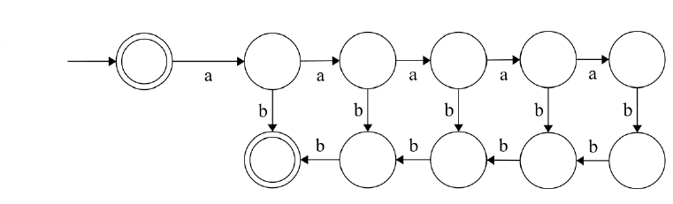
```

Intuitively a <b>stack</b> would be needed to parse such a structure. The following CFG can do this (it's recursive, hence will use a stack)

```
EXPR ::= "a" "b" | "a" EXPR "b"
```

See, for further reading on [grammars](http://web.mit.edu/6.005/www/fa16/classes/17-regex-grammars/). We will develop a parser for different goals:

1. Check a string for compliance
2. Returning the complete parse tree
3. Returning the AST

The below grammar will be used to demonstrate the development of the parser:

```
Expr ::= Num | Add | Sub | Mul | Div
Add ::= "add" "(" Expr "," Expr ")"
Sub ::= "sub" "(" Expr "," Expr ")"
Mul ::= "mul" "(" Expr "," Expr ")"
Div ::= "div" "(" Expr "," Expr ")"
Num ::= an optional sign followed by a sequence of digits: [-+]?[0-9]+
```

Lets try parsing the following expression `mul(sub(mul(65,74),add(68,25)),add(div(5,3)15))`

```{r example-cpt, fig.cap="The concrete parse tree"}
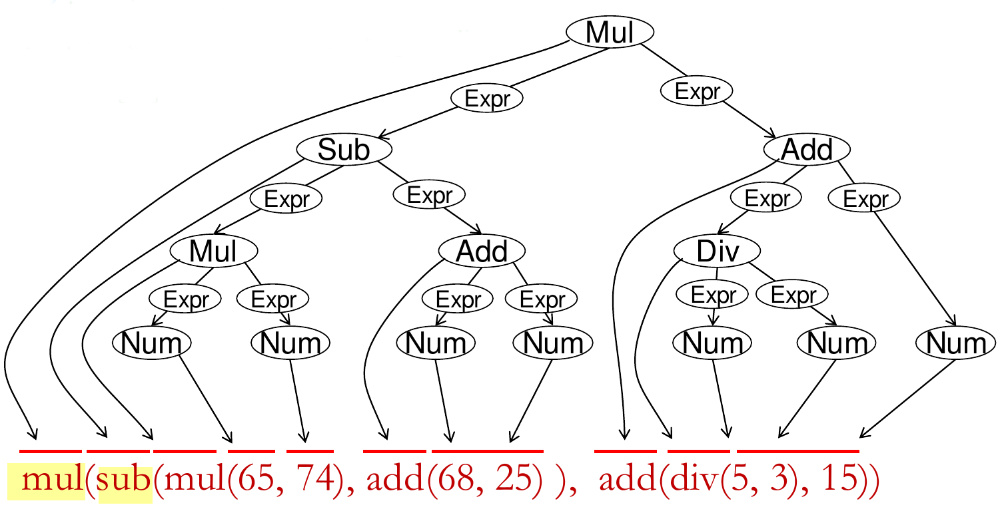
```


<b>Algorithm</b>

1. Build a set of mutually-recursive functions/methods, based on the rules in the grammar.
2. One function for each nonterminal
3. Decide which branch to follow based on the next input token
4. Within the branch, test for each terminal/nonterminal token.
5. Fail if the expected token is missing or no option is available
6. Return a boolean if you're just checking the string for compliance or the parse tree if you are creating it.

The above algorithm will only work if you can choose the next path to follow based on the current token and the next token.

E.g. To parse the expression `"add(-5, sub(50,50),4)"`, the first token is <i>"add"</i> so the `parseAdd()` function should be called. However `parseAdd()` will need to check for the token "add", so we need to be able to <i>peek</i> at the top token without removing it from the top of the `Scanner`

#### Peek at the Next Token

Java's `Scanner` class is able to peek at the next token in order to work out which branch to take, <i>but not consume the next token</i>. The `Scanner` class has two `hasNext` methods:

* `sc.hasNext()`
  * Is there another token in the scanner?
* `sc.hasNext("string to match")`
  * Is there another token, and does it match the string passed in as the argument?
  
```java
if (sc.hasNext("add")) {
 ...
}
```

The second form of `hasNext` can be used to peek and check the next token. The string that is passed can also be a regex.

```java
if (sc.hasNext("[-+]?[0-9]+")) {
 ...
}
```
<i>true if the next token is an integer</i>


## Parsing Expressions - Checking a string Complies to the Grammar Rules


```java
// Have to choose one branch to follow
// Passes if at least one rule is true
boolean parseExpr(Scanner sc) { 
  if (sc.hasNext("[-+]?[0-9]+")) {
    sc.next();
    return true;
  }
  if (sc.hasNext("add"))
    return parseAdd(sc);
  if (sc.hasNext("sub"))
    return parseSub(sc); 
  if (sc.hasNext("mul"))
    return parseMul(sc);
  if (sc.hasNext("div"))
    return parseDiv(sc);
  return false;
}
// All branches must be checked 
// Fails if any branch fails
boolean parseAdd(Scanner sc) {
   if (sc.hasNext("add"))
    sc.next();
   else
    return false;
   if (sc.hasNext("("))
    sc.next();
   else
    return false;
   if (!parseExpr(sc))
    return false;
   if (sc.hasNext(","))
    sc.next();
   else
    return false;
   if (!parseExpr(sc))
    return false;
  if (sc.hasNext(")"))
    sc.next();
   else
    return false;
   return true;
} 
```

The functions `parseSub`, `parseMul` and `parseDiv` will follow along from `parseAdd`

```java
boolean parseSub(Scanner sc) {
   if (sc.hasNext("sub"))       // Only difference from parseAdd
    sc.next();
   else
    return false;
   if (sc.hasNext("("))
    sc.next();
   else
    return false;
   if (!parseExpr(sc))
    return false;
   if (sc.hasNext(","))
    sc.next();
   else
    return false;
   if (!parseExpr(sc))
    return false;
   if (sc.hasNext(")"))
    sc.next();
   else
    return false;
   return true;
```

This means the implementation can be substantially simplified due to the similarity of the Add, Sub, Mul and Div methods:

```java
boolean parseExpr(Scanner sc) {
 if (sc.hasNext("[-+]?[0-9]+")) {
    sc.next();
    return true;
  }
 if (sc.hasNext("add|sub|mul|div"))
   sc.next();
 else
   return false;
 if (sc.hasNext("("))
    sc.next();
 else
   return false;
 if (!parseExpr(sc))
   return false;
 if (sc.hasNext(","))
   sc.next();
 else
   return false;
 if (!parseExpr(sc))
   return false;
 if (sc.hasNext(")"))
   sc.next();
 else
   return false;
 return true;
}
```

This change amounts to refactoring the grammar to have the following rules:

```
Expr ::= Num | Op "(" Expr "," Expr ")"
Op ::= "add" | "sub" | "mul" | "div"
Num ::= [-+]?[0-9]+
```

Further simplification can be achieved by reducing duplication by reusing the pattern that checks for terminals

```java
boolean parseExpr(Scanner sc) {
  if (sc.hasNext("[-+]?[0-9]+")) {
    sc.next();
    return true;
  }
  require(sc, "add|sub|mul|div");
  require(sc, "(");
  if (!parseExpr(sc))
    return false;
  require(sc, ",");
  if (!parseExpr(sc))
    return false;
  require(sc, ")");
  return true;
}

// Consume the next token and return true if matches pattern, else false
boolean require(Scanner sc, String pattern) {
  if (sc.hasNext(pattern)) {
    sc.next();
    return true;
  }
  // Print an error message
  return false;
}
```

Further <b>efficiencies</b> can be realised by pre-compiling the regex patterns. Giving good names to the specific patterns can make the program <b>easier to understand</b>

```java
Pattern numPattern = Pattern.compile("[-+]?(\\d+([.]\\d*)?|[.]\\d+)");
Pattern addPattern = Pattern.compile("add");
Pattern subPattern = Pattern.compile("sub");
Pattern mulPattern = Pattern.compile("mul");
Pattern divPattern = Pattern.compile("div");
```

## Parsing Expressions - Constructing the Concrete Parse Tree

Rather than just checking that the input is, you can construct and return the parse tree i.e. for the expression `add(sub(10, -5), 45)

```{r example-pt}
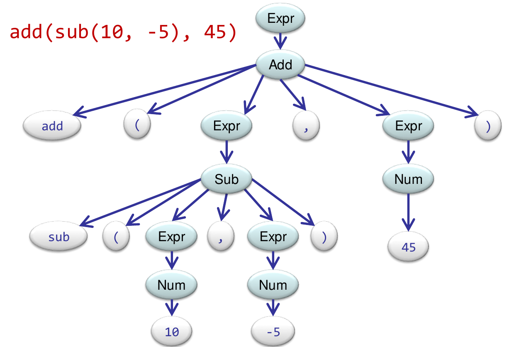
```

To do this you <span style='color: lightseagreen;'>each parse method</span> return a tree node, instead of a `boolean`

```java
Node parseExpr(Scanner sc)
Node parseNum(Scanner sc)
Node parseAdd(Scanner sc)
Node parseSub(Scanner sc)
Node parseMul(Scanner sc)
Node parseDiv(Scanner sc)
```

There are two options for the parse trees data structure:

1. Have a node class for each rule i.e. the parse expressions will return a sub-type of the `Node` super-type:

  * `ExpressionNode`: For a `NumberNode` or `OperatorNode`
  * `OperatorNode`: For the Add/Sub/Mul/Div nonterminals. This node will store the operator, "(", first expression, "," second expression and the ")" character
  * `NumberNode`: Will contain the numeric value and the sign
  * `TerminalNode`: Will contain the string

2. Have a general tree, with a label at each node and a list of children.

### Data Structure: Option one

```java
interface Node {}

class ExpressionNode implements Node {
  final Node child;
  public ExpressionNode(Node child) {
    this.child = ch;
  }
  public String toString() {
    return "[" + child + "]"; // Brackets added to show structure
  }
}

class NumberNode implements Node {
  final int value;
  public NumberNode(int value) {
    this.value = value;
  }
  public String toString() {
    return value; 
  }
}

class TerminalNode implements Node {
  final String value;
  public TerminalNode(String value) {
    this.value = value;
  }
  public String toString() {
    return value; 
  }
}

class AddNode implements Node {
  final List<Node> children;
  public AddNode(List<Node> children) {
    this.children = children;
  }
  public String toString() {
    String result = "[";
    for (var node : children) 
      result += node.toString();
    return result;
  }
}
// SubNode, MulNode, and DivNode are similiar
```

### Error Handling

Unlike when the expression was being validated, `false` cannot be returned to indicate and <span style='color: red;'><b>handle errors</b></span>. The parser must <span style='color: red;'><b>throw an exception</b></span> to signify an error has occurred when parsing the expression. This means each method will return <i>either</i> a valid `Node`, <i>or</i> throw an `Exception`.

```java
class ParseException extends RuntimeException
  public ParseException(String errorMessage, Scanner sc) {
    String message = "Grammar Parse Error: " + errorMessage + "@... ";
    for (int i = 0; i < 5 && sc.hasNext(); i++)
      message += " " + sc.next();
    super(message);
  }
```

### Building the Parse Tree

To create a specific `Node`, first parse and build it's child/constituent components and then build the specific component i.e. To create a `ExpressionNode` build it's child `NumberNode`/`AddNode`/`SubNode`/`MulNode`/`DivNode` first.

```java
Node parseExpr(Scanner sc) {
  if (!sc.hasNext())
    throw new ParseExpression("Expression.empty", sc);
  
  Node child = null;
  if (sc.hasNext("[-+]?\\d+"))
    child = parseNum(sc);
  else if (sc.hasNext("add"))
    child = parseAdd(sc);
  else if (sc.hasNext("sub"))
    child = parseAdd(sc);
  else if (sc.hasNext("mul"))
    child = parseAdd(sc);
  else if (sc.hasNext("div"))
    child = parseAdd(sc);
  
  return new ExpressionNode(child);
}

Node parseNum(Scanner sc) {
  if (!sc.hasNext(sc)) 
    throw new ParseException("Not a Number", sc);
  return new NumberNode(sc.nextInt());
}

Node parseAdd(Scanner sc) {
  List<Node> children = new ArrayList<>();
  if (!sc.hasNext("add"))
    throw new ParseException("add.missing", sc);
  
  children.add(new TerminalNode(sc.next()));
  
  if (!sc.hasNext("(")))
    throw new ParseException("(.missing", sc);
    
  children.add(parseExpr(sc)); // Don't need to check whether parse methods succeed
  
  if (!sc.hasNext(",")))
    throw new ParseException(",.missing", sc);
    
  children.add(parseExpr(sc));
    
   if (!sc.hasNext(")")))
    throw new ParseException(").missing", sc);
    
  return new AddNode(children);
}

// The methods for parsing sub, mul and div nodes are all similiar
```

The above methods will create the <span style='color: lightseagreen;'>concrete syntax tree (CST)</span>, which contains a lot of redundant information E.g. in the parse tree for the HTML file, we know that every HEAD has "&lt;head&gt;" and "&lt;/head&gt;" terminals. We only care about what the TITLE nonterminal is, and then only the unknown string terminal part of the TITLE.

An <span style='color: lightseagreen;'>abstract syntax tree (AST)</span> is of greater interest as it only keeps the tokens that are semantically meaningful.
    
For the expression `add(add(sub(10, -5), 45))` the CST is:

```{r example-cst-expr}
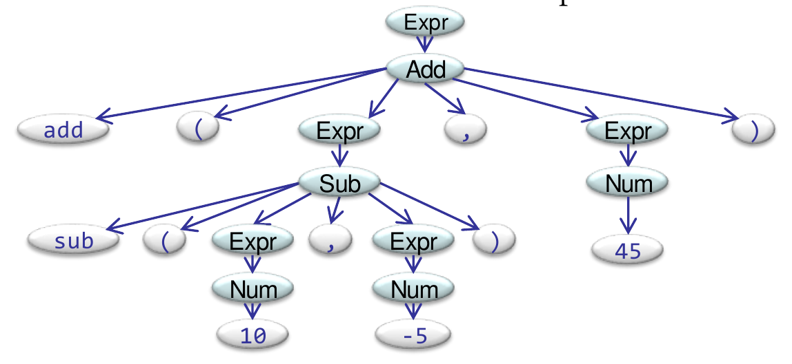
```

In comparison, the AST is much more concise:

```{r example-ast-expr}
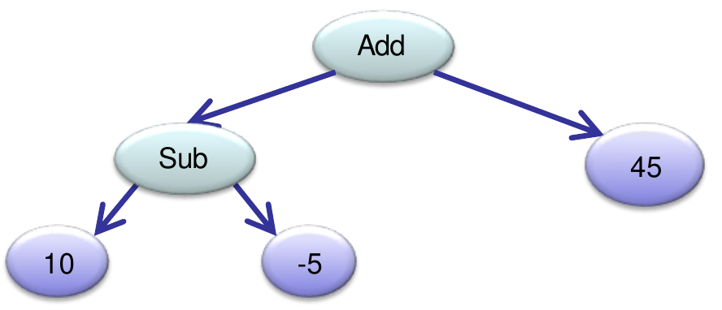
```

The literal strings such as "add", ",", "sub", "(", ")" are redundant and can be removed. Additionally the `ExpressionNode` and `NumberNode` (numeric token is retained) are redundant and are also removed from the CST to form the AST. In fact the `ExpressionNode` and `TerminalNode` classes can be removed entirely 

However, the `NumberNode` is unchanged.

```java
class NumberNode implements Node {
  private final int value;
  public NumberNode(int value) {
    this.value = value;
  }
  public toString() {return "" + value;}
}
```

The `AddNode` (and `SubNode`, ...) classes become simpler to implement as only the left and right expressions need to kept.

```java
class AddNode implements Node {
  private final Node left, right;
  public AddNode(Node left, Node right) {
    this.left = left;
    this.right = right;
  }
  public toString() {
    return "add(" + left + "," + right ")";
  }
}
```

Some of the <i>parsing</i> methods become simpler, but not all do e.g. `parseNum` is unchanged

```java
Node parseNum(Scanner sc) {
  if (!sc.hasNext(sc)) 
    throw new ParseException("Not a Number", sc);
  return new NumberNode(sc.nextInt());
}
```

The `ParseExpr` method is simplified as `ExpressionNode`'s no longer need to be created, just the constituent node.

```java
Node parseExpr(Scanner sc) {
  if (sc.hasNext("[-+]\\d+")) 
    return parseNum(sc);
  if (sc.hasNext("add"))
    return parseAdd(sc);
  if (sc.hasNext("sub"))
    return parseSub(sc);
  if (sc.hasNext("mul"))
    return parseMul(sc);
  if (sc.hasNext("div"))
    return parseDiv(sc);
  throw new ParseException("Node.unknown or Node.missing", sc);
}
```

Likewise, `parseAdd` ... are simpler

```java
Node parseAdd(Scannar sc) {
  private final Node left, right
  require("add", "add.missing", sc);
  require("(", "(.missing", sc);
  left = parseExpr(sc);
  require(",", ",.missing", sc);
  right = parseExpr(sc);
  require(")", ").missing", sc);
  return new AddNode(left, right);
}

// Consume and return the next token if it matches the pattern, else throw an exception
void require(String pattern, String errorMessage, Scanner sc) {
  if (sc.hasNext(pattern)) {
    sc.next();
    return sc;
  }
  throw new ParseException(errorMessage, sc);
}
```

After constructing the AST, it can be <b>evaluated</b>, that is the result of the input expression can be calculated. All that needs to be done is for the `Node` interface to have an `evaluate` method, requiring all subclasses to implement it. For the more complicated classes such as `AddNode` the expression can be evaluated with a recursive DFS.

```java
interface Node {
  public int evaluate();
}

class NumberNode implements Node {
  ...
  public int evaluate() {return value;}
}

class AddNode implments Node {
  ...
  public int evaluate() {
    return left.evaluate() + right.evaluate(); // Recursive DFS expression tree
  }
  
  public String toString() { // Print the expression in human readable infix notation
    return "(" + left + "," right + ")";
  }
}
```

## Extending the Grammar

Now that we can build the AST and evaluate it, we want to extend the grammar to allow for floating point numbers and integers. This means we require more complex patterns for numbers.

```java
class NumberNode implements Node {
  private final double value;
  public NumberNode(double value) {
    this.value = value; 
  }
  public String toString() {
    return String.format("%.5f", value);
  }
  public double evaluate() {
    return value;
  }
}
```

Example: `add(10.5, -8)`

```
Print -> (10.5 + -8.0)
Value -> 2.500
```

Example: `add(sub(10.5,-8),mul(div(45,5),6.8))`

```
Print -> ((10.5 - -8.0) + ((45.0 / 5.0) * 6.8))
Value -> 79.700
```

What about extending the grammar so that each rule can take more than two arguments

```
Expr ::= Num | Add | Sub | Mul | Div
Add ::= "add" "(" Expr ["," Expr]+ ")"
Sub ::= "sub" "(" Expr ["," Expr]+ ")"
Mul ::= "mul" "(" Expr ["," Expr]+ ")"
Div ::= "div" "(" Expr ["," Expr]+ ")"
Num ::= [-+]?[0-9]+
```

```{r example-ast-expr2, fig.cap="The AST for the expression add(45,16,sub(10,5,1),34)"}
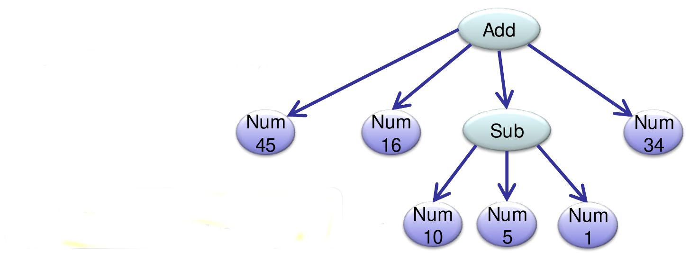
```

`sub(10,5,1)` <i>could</i> mean 10 -  5 - 1, the order the operands are evaluated in will be determined by `evaluate()`. To account for 2+ arguments to nonterminals, the parsing methods and data structures need to be generalised:

```java
class AddNode implements Node {
  private final List<Node> arguments;
  public AddNode(List<Node> arguments) {
    this.arguments = arguments;
  }
  public String toString() {
    String answer = "(" + arguments.get(0);
    for (var arg : arguments)
      answer += " + " arg;
    
    return answer + ")";
  }
  public double evaluate() {
    double answer = 0;
    for (var arg : arguments)
      answer += arg;
     return answer;
  }
 }
 
Node parseAdd(Scanner sc) {
  private List<Node> args = new ArrayList<>();
  require("add", "Expecting add", sc);
  require("(", "Missing '('", sc);
  args.add(parseExpr(sc));
  do {
    require(",", "Missing ','", sc);
    args.add(parseExpr(sc))
  } while (!sc.hasNext(")"));
  require(")", "Missing ')'", sc);
  return new AddNode(args);
}
```

## LL(1) 

The previous grammar is known as a <b>LL grammar</b>. A LL grammar is a context-free grammar that can be parsed by a LL parser, which deterministically parses the input from <b>L</b>eft to right, and constructs a <b>L</b>eftmost derivation^[in a leftmost derivation the leftmost nonterminal in the sequence of nonterminals is evaluated first] of the input string.

### When does it work

If we have a grammar rule involving <i>choices</i>:

```
N ::= W1 | W2 | ... | Wn
```

we must be able to tell which alternative to take, by only looking at the <b>next</b> input token. Put, formally:

For any <i>i</i> and <i>j</i> (where <i>i</i> != <i>j</i>) there is no symbol that can start <b>both</b> an instance of <b>W_i</b> and an instance of <b>W_j</b>.

This rule is easy to check if <b>W_i</b> and <b>W_j</b> start with terminals, what if they start with nonterminals?

### Grammars that Fail LL(1)

```
IfStmt ::= "if" "(" Cond ")" Stmt | "if" "(" Cond ")" Stmt "else" Stmt
```

The two choices share the same leading terminals and subsequent terminals e.g. "if" and "(" so this grammar fails the LL(1) rule

```
A ::= B "c" | B "d"
```

The two choices share the same leading nonterminal, this means it is not possible to determine which branch to follow.


```
E ::= num | E "+" E | E "-" E | E "*" E | E "/" E
```

This grammar defines "infix" arithmetic expressions, for all choices other than the first, the LL(1) rule would fail as they share the same leading nonterminal. This grammar is also ambiguous.

#### Left-factoring

Consider the first grammar rule:

```
IfStmt ::= "if" "(" Cond ")" Stmt | "if" "(" Cond ")" Stmt "else" Stmt
```

If we see an "if", we can't tell which branch to take, this can be fixed by 'factoring' out the common part:

```
IfStmt ::= "if" "(" Cond ")" Stmt RestIf
RestIf ::= "" | "else" Stmt
```

The following code is now able to parse input strings conforming to the grammar:

```java
Node parseIfStmt(Scanner sc) {
  require("if", "Missing 'if'", sc);
  require("(", "Missing '('", sc);
  Node condition = parseCond(sc);
  require(")", "Missing ')', sc);
  Node thenPart = parseStmt(sc);
  Node elsePart = parseRestIf(sc);
  return IfNode(condition, thenPart, elsePart);
  
}

Node parseRestIf(Scanner sc) {
  if (sc.hasNext("else")) {
    sc.next();
    return parseStmt(sc);
  }
  return null; // Take the empty branch if no other branch is possible, using null to represent the empty string
}
```

This idea can be applied to many other grammars that would otherwise fail LL(1):

```
// Fails LL(1)

A ::= B "c" | B "d"

// Left-factoring

A ::= B E
E ::= "c" | "d"
```

```
// Fails LL(1)

A ::= B "c" | D "e"
B ::= "f" "g" | "h" "i"
D ::= "h" "j" | "k" "l"

// Left-factoring

A ::= "h" M | "f" "g" "c" | "k" "l" "e"
M ::= "i" "c" | "j" "e"
```

These left-factorings can be performed through simple algebraic laws - like simplifying boolean expressions.

## Grammar for Constructing Lists

Consider the following grammar for lists of identifiers separated by commas. Informally a list is either an identifier, or two lists separated by a comma:

```
L ::= id | L ",", L
```

This grammar is <span style='color: lightseagreen;'>ambiguous</span> - we can construct more than one parse tree for some given strings. For example there are two possible parse trees for the input text `"a,b,c"`

```{r ambigous, fig.align="centre", fig.cap="The grammar for a list results in multiple possible parse trees due to ambiguity"}
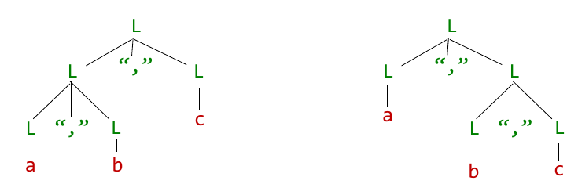

```

Recursive descent doesn't work for ambiguous grammars - must be able to construct a unique parse tree for any text in the language. The above example showed that two parse trees could be formed for the "a,b,c", imagine the number of different possible parse trees for `"a,b,c,d,e, ..."`!

### Left-recursion

The grammar for a list could be rewritten to make it left-recursive:

```
L ::= id | L, "," id
```

This is now an unambiguous grammar - However any `L` nonterminal must start with an `id` nonterminal; if an `id` is seen it is no longer possible to tell which branch to take, failing the <b>LL(1)</b> rule. In this case left-factoring cannot be used to factor out the common parts into a new rule.

<span style='color: red;'>In general, recursive descent doesn't work for grammars with <b>left-recursive rules</b> (where the nonterminal on the left occurs at the start of some branch on the right)</span>.


### Right-recursion

Instead this grammar can be rewritten to be right-recursive:

```
L ::= id | id "," L
```

This is an unambiguous grammar <b>and</b> the common parts can be factored to satisfy the <b>LL(1)</b> condition:

```
L ::= id R
R ::= "" | "," L
```

However this will create a parse tree where the identifiers are in the reverse order to the input expression.

## Infix Expressions

Consider the following grammar for arithmetic expressions:

```
E ::= number | E "+" E | E "-" E | E "*" E | E "/" E | "(" E ")"
```
This is an ambiguous grammar, as many parse trees can be created for some expressions. However does it matter which parse tree is used? Yes, as the order of evaluation is important in some cases i.e. 2 + 3 is the same as 3 + 2, but 2 - 3 is not the same as 3 - 2.

For the expression `65 * 74 - 68 + 25 * 5 / 3 + 16` the following parse trees can be formed.

```{r left-recursive, fig.align="centre", fig.cap="Left-Recursive parse tree"}
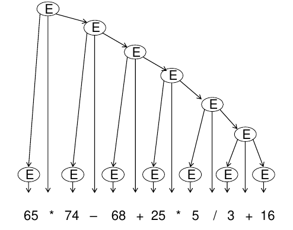
```


```{r right-recursive, fig.align="centre", fig.cap="Right-Recursive parse tree"}
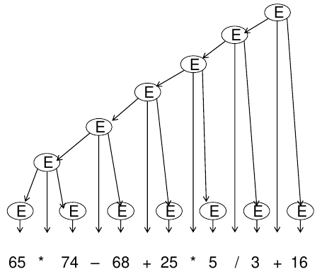
```

```{r infix-recursive, fig.align="centre", fig.cap="Parse tree created from in-place traversal"}
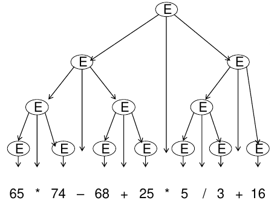
```

And none of the above parse trees conform to the rules of operator precedence i.e. BEDMAS

The grammar can be made unambiguous by making it right-recursive, as with the list grammar:

```
EXPR ::= number | number "+" EXPR | number "-" EXPR | number "*" EXPR | number "*" EXPR | number "/" EXPR
```

And it can then be made <b>LL(1)</b> by left-factoring

```
EXPR ::= number RESTOFEXPR
RESTOFEXPR ::= "+" EXPR | "-" EXPR | "*" EXPR | "/" EXPR | ""
```

But what will the resultant parse tree look like? And will it evaluate expressions correctly as intended? - No the above grammar has no rule for handling operator precedence

Operator precedence can be handled by introducing a new nonterminal to the grammar

```
EXPR ::= TERM | TERM "+" EXPR | TERM "-" EXPR | TERM "*" EXPR | TERM "/" EXPR

TERM ::= number | number "*" TERM | number "/" TERM | "(" EXPR ")"
```

And made <b> LL(1)</b> by left-factoring:

```
EXPR ::= TERM RESTOFEXPR
RESTOFEXPR ::= "+" EXPR | "-" EXPR | ""
TERM ::= number RESTOFTERM
RESTOFTERM ::= "*" TERM | "/" TERM | ""
```

This grammar will now create an unambiguous parse tree that evaluates the expression correctly

```{r infix-expression, fig.align="centre", fig.cap="The right-recursive LL(1) parse tree for evaluating infix expressions with the correct operator precedence"}
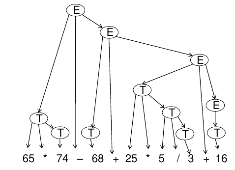
```

### A More Practical Approach

Instead of writing the grammar:

```
E ::= number | E "+" E | E "-" E | E "*" E | E "/" E | "(" E ")"
```

like:

```
EXPR ::= TERM RESTOFEXPR
RESTOFEXPR ::= "+" EXPR | "-" EXPR | ""
TERM ::= number RESTOFTERM
RESTOFTERM ::= "*" TERM | "/" TERM | ""
```

Write it like

```
E ::= T [("+" | "-") T]*
T ::= F[("*" | "/") F]*
F ::= number | "("E ")"
```

And the parser will become

```java
Node parseExpr(Scanner sc) {
  Node term = parseTerm(sc);
  while (sc.hasNext(addOrSubPattern)) {
    String operator = sc.next();
    Node right = parseTerm(sc);
    if (operator.equals("+"))
      term = new AddNode(term, right);
    else term = new SubNode(term, right);
  }
  return term;
}

Node parseTerm(Scanner sc) {
  Node factor = parseFactor(sc)
  while (sc.hasNext(multOrDivPattern)) {
    String operator = sc.next();
    Node right = parseFactor(sc);
    if (operator.equals("*"))
      factor = new MultNode(factor, right);
    else factor = new DivNode(factor, right);
  }
  return factor;
}

Node parseFactor(Scanner sc) {
  if (sc.hasNext(numPattern))
    return new NumNode(sc.next())
  if (!sc.hasNext(openParenthesis)) {
    throw new ParseException("Expected '('");
  }
  sc.next();
  Node expression = ParseExpr(sc);
  if (!sc.expression(closeParenthesis)) {
    throw new ParseException("Expected ')'");
  }
  return expression;
}
```