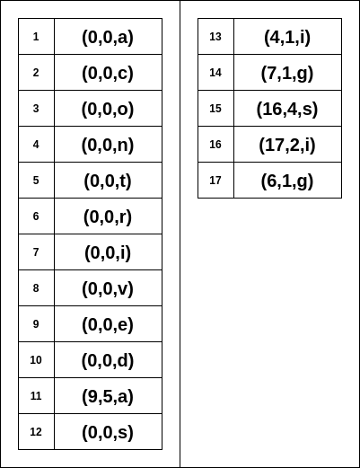

# Data Compression {#compression}

Data compression is a reduction in the number of bits needed to represent <b>data</b>. Compressing data can save space when storing and time when transmitting it

* A typical Blu-ray movie is about 25 Gb
* A uncompressed 1080p video stream transmits about 0.8 Gb/s

Most file types have a lot of redundancy e.g. text files are hugely redundancy - 8 bits or more are used to store each character, but there is far less information than 8 bits in each character.

Every day, over 2.5 quintillion bytes of data is created, so much so that over 90% of the data in the world today has been created in the last two years alone.

## Applications

1. Generic file compression
    * Files: GZIP, BZIP, 7z
    * Archivers: PKZIP
    * File systems: NTFS, HFS+, ZFS
2. Multimedia
    * Images: GIF, JPEG
    * Sound: MP3
    * Video: MPEG, DivX, HDTVS
3. Communication
    * ITU-T T4 Group 3 Fax
    * V.42bis modem
    * Skype
    * Zoom

## Lossless vs Lossy Data Compression

There are two broad types of compression algorithms, lossless and lossy.

### Lossless

Lossless compression algorithms exploit statistical redundancy in data and remove it to store the data compactly. No information is lost, so the process is reversible (decompression) and the original state can be restored. Many types of text and numerical files exhibit statistical redundancy, For example, an image may have areas of color that do not change over several pixels; instead of coding "red pixel, red pixel, ..." the data may be compressed and encoded as "279 red pixels"^[This is a basic example of run-length encoding].

Lossless compression removes redundant elements in the data by identifying repeated patterns and:

* Replacing repeated characters by a count and the character e.g. "279 red pixels"
* Or Constructing a dictionary of terms/words in the data and replacing each word with it's index

### Lossy

In lossy compression algorithms, some degree of loss of information is accepted as dropping nonessential detail can save storage space. There is a corresponding trade-off between preserving information and reducing size. Lossy data compression schemes are designed by research on how people perceive the data in question. 

* MP3 sound compression works by removing non-audible (or less audible) components of the audio signal.

Data compressed by a lossy compression algorithm cannot be restored back to its original state.

## Encoding

Encoding is the process of converting data from one form to another form. Compression algorithms encode symbols (characters, numbers, ...) into a more compact form. One way of doing this is to encode each symbol as a sequence of bits; using a separate code for each symbol while minimizing the number of bits needed to represent the distinct symbols^[When encoding data for storage or transmission purposes, we often add extra bits i.e. redundancy so we can detect errors].

Huffman coding is a common and widely used algorithm of the above description of compression encoding

### Equal Length Codes

One approach to encoding symbols to bits is to use equal length bit codes, that is the same number of bits for every symbol to be encoded.

```{r equal-length-codes-digits, fig.cap='Using equal length codes to represent digits'}
knitr::include_graphics("img/11-image1.png")
```

[ASCII](https://wow.wikiwand.com/en/ASCII) is an encoding standard that uses equal length codes (8-bits) to represent text characters.

In the above figure, 4-bits are needed to uniquely represent each of the 10 digits, however for letters in the alphabet, this number is 5-bits for each of the 26 symbols.

```{r equal-length-codes-letters, fig.cap='Using equal length codes to represent letters in the alphabet'}
knitr::include_graphics("img/11-image2.png")
```
These are both more compact encodings than used in the ASCII encoding standard (8-bits). How many would more bits would be needed to represent upper and lowercase symbols? 6-bits ($2^6 = 64 > 52$).

With `N` bits we can have $2^N$ different codes. Taking this further, you need $\log_2(N)$ bits to represent an alphabet with $N$ different symbols.

* 10 numbers, bit length = 4
* 26 letters, bit length = 5
* 53 letters, bit length = 6

Can better results be achieved?

* Where the probability of occurrence for each symbol differs? 
* Where the probability of occurrence is the same?

### Variable Length Codes

Variable Length encoding uses a different number of bits to encode different symbols. Fewer bits are used to represent the most common symbols.

### Example

```{r vle-example}
example <- "aabajabaab"
percent <- scales::label_percent()
symbol <- dplyr::tibble(Symbol = c("a", "b", "d", "e", "f", "h", "i", "j"),
                        Occurence = percent(c(0.5, 0.25, rep(0.05, 2), rep(0.02, 4))),
                        "Variable Encoding" = c("0", "1", "10", "11", "100", "110", "111", "1000"),
                        "Fixed Encoding" = c("000", "001", "010", "011", "100", "101", "110", "111"))
knitr::kable(symbol)
```

A document summarized by the table above has `r nrow(symbol)` symbols to be encoded. Using variable length encoding the symbols `a` and `b` are encoded with a single bit as they are the most commonly occurring symbols. 

Using fixed length encoding The string '`r example`' can be encoded as:  

`000 000 001 000 111 000 001 000 000 001`

While using the variable length encoding scheme the same string can be encoded to:  

`0 0 1 0 1000 0 1 0 0 1`  
  
Fixed length encoding takes `r nchar(example) * 3` bits to represent the string, while variable length encoding can represent it in
just 13 bits.


## Prefix-free codes

How do we avoid ambiguity? e.g. is `110` the encoding for `i`, `bba` or `ea`? To avoid ambiguity __ensure__ that no code word is a <span style='color: green;'>prefix</span> of another.

```{r prefix-free}
symbol <- dplyr::tibble(symbol = letters[1:8],
                        encoding = c("0", "10", "1100", "11101", "11100", "11111", "11010", "110110"))
```

How can we design codes that are <i>prefix-free</i>? We can think of prefix-free codes as path labels to leaves in a binary tree (trie).

* Symbols in leaves
* The encoding is path from root to leaf


```{r prefix-trie}
knitr::include_graphics("img/11-image3.png")
```


What shaped tree will give the best encodings? A balanced tree will give fixed-length codes. We want the high-frequency symbols at the top of tree (shortest codes) and the least frequent at the bottom.


#### Algorithm for Building the Prefix-free Tree

The trie should be built from the "bottom-up", combining the nodes with lowest frequencies:

1. Prepare a collection of leaf nodes for each symbol. Put the leaf nodes onto a <span style='color: green;'>priority queue</span> ordered by frequency.
2. Remove the first two nodes (lowest frequency) and combine these two into a new tree whose root has the two nodes as children and whose weight is the sum of the weights of the two children trees.
  * The root node of this new tree is known as an internal node and needs to be ignored when encoding and decoding symbols
  * The lower-frequency child should become the left child and the higher-frequency child as the right node
3. Add this new tree to the queue
4. Repeat until all nodes are combined into a single trie

The encoding for each symbol is found by traversing the <b>external</b> nodes in the tree:

* Descend down left child = 0
* Descend down right child = 1

Traversal stops once you node with the correct symbol or until you reach the leaf node.


## Huffman Coding

Dynamically creates a prefix-free tree for the string of symbols to compress. It gurantees the <i>best</i> compression encoding, given the frequencies of all symbols within the string.

### Compression

* Read in the file to compress
* Build the <span style='color: green;'>best</span> prefix-free code for the tree
* Compress file using the prefix-free code
* Write out the compressed file and prefix-free tree.

In order to store or transmit the compressed file, the prefix-free tree needs to be included for decompressing the tree. This can reduce the efficiency of the Huffman coding compression algorithm. An alternative is too use a standard frequency table e.g. known frequencies of letters in english texts. But this will also reduce the efficiency of the algorithm as it no longer tailored to the specific file being encoded.

### Decompress

* Read the prefix-free code tree from file
* Read compressed file and expand using the tree


### Huffman Trie Node

```java
private static class Node implements Comparable<Node> {
  private final char symbol; // Only for leaf nodes
  private final int freq; // Used for building the prefix-tree
  private final Node left;
  private final Node right;
  
  public Node(char symbol, int freq, Node left, Node right) {
    this.symbol = symbol;
    this.freq = freq;
    this.left = left;
    this.right = right;
  }
  
  public boolean isLeaf() {
    return left == null && right == null;
  }
  
  public int compareTo(Node other) {
    return freq - other.freq;
  }
}
```

### Shannon and Information Theory

The lossless compression algorithm Huffman coding minimizes the number of bits for each symbol. Can better compression results be achieved looking at sequences of symbols?

[Shannon's source coding theory](https://www.wikiwand.com/en/Shannon%27s_source_coding_theorem) states the <i>optimal</i> code length for a symbol is $\log_2(P)$, where $P$ is the probability of the input symbol. The average of this, over the whole alphabet, is called the [<i>entropy</i>](https://www.wikiwand.com/en/Entropy_(information_theory), $H$.

* If $P$ was "flat" meaning all letters in the alphabet are equally likely then $H=$ `r log2(26)`.
* However in practice the entropy of english letters is around 4.2 bits per [character](http://www.shannonentropy.netmark.pl/)

This indicates that there is a lot of redundancy in the english language (due to the observed decrease in $H$). 

<span style='color: blue;'>
Fr xmpl, y cn prbbly gss wht ths sntnc sys, vn wth ll f th vwls mssng. Tht ndcts that the nfrmtn cntnt b xtrctd frm th rmnng smbls
</span>

<span style='color: red;'>Aoccdrnig to rscheearch at Cmabirgde Uinervtisy, it deosn't mttaer om waht oredr the ltteers in a wrod are, the olny iprmoetnt tihng is taht the frist and last ltteer be at the rghit pclae. The rset can be a ttoal mses and you can sitll raed it wouthit porbelm. Tihs is bcuseae the huamn mnid deos not raed ervey lteter by istlef, but the wrod as a wlohe. Amzanig huh?</span>

The above examples make it clear that sequences of symbols have less entropy than individual symbols in the english language. One strategy of calculating the entropy for <i>sequences</i> of symbols uses N-grams. One can statistically calculate the entropy of the next letter when the previous N - 1 letters are known. As N increases, the entropy approaches $H$, or the entropy of English.

The following table are the calculated values from Shannon's paper. $F_N$ is the entropy associated with the $N^{th}$ letter when the previous $N -1$ letters are known. $F_0$ is simply the maximum entropy for the set of letters, where each has an equal probability.


<table border="1" cellspacing="1" width="100%">
      <tr>
        <td width="16%">&nbsp;</td>

        <td width="16%">F<small><small>0</small></small></td>

        <td width="17%">F<small><small>1</small></small></td>

        <td width="17%">F<small><small>2</small></small></td>

        <td width="17%">F<small><small>3</small></small></td>
      </tr>
      <tr>
        <td width="16%">26 letter</td>

        <td width="16%">4.70</td>

        <td width="17%">4.14</td>

        <td width="17%">3.56</td>

        <td width="17%">3.3</td>
      </tr>
</table>
  
  
The below table gives some examples of the most common digrams and trigrams in the English language. From the above table the entropy if you use trigrams ($F_3$) drops to 3.3    
    
```{r ngrams}
ngrams <- dplyr::tibble(Digrams = c("EN", "RE", "ER", "NT", "TH", "ON", "IN", "TR", "AN", "OR"),
              Trigrams = c("ENT", "ION", "AND", "ING", "IVE", "TIO", "FOR", "OUR", "THI", "ONE"))
knitr::kable(ngrams)
```

So what's the entropy of the English language as whole i.e. the Shannon limit. Shannon uses an approximating function to estimate the entropy for over 8,000 words. The calculated value he gets for the entropy per word is 11.82 bits, and since the average word has 4.5 letters, the entropy is 2.62 bits per letter.


## Run-Length Encoding (RLE)

If data contains lots of runs of repeated symbols, it may be more efficient to store the data as (count, symbol) pairs.

```{r rle-text}
rle <- dplyr::tibble(Data = "aaabbaaaaaapaa", RLE = "3a2b6a1p2a")
knitr::kable(rle)
```

This also works for black and white image data which can be stored in 6-bits. The first 5-bits for the count, and 1 bit to say what value is expected.

```{r rle-image}
rle <- dplyr::tibble(Data = "111111110000001111111111111", RLE = "010001 001100 011011")
knitr::kable(rle)
```

However this does not work well for data without much runs of repeated symbols e.g. `r cat('abcabcabbaccabacabcbcaabcb')` or `r cat('01010100110101010101')`

### Lempel-Ziv

Lempel-Ziv is a lossless compression algorithm like Huffman coding. Unlike Huffman coding that encodes single symbols, LZ compression compresses repeated sequences/patterns. LZ is fairly simple compression technique that is th basis for many later, more sophisticated compression schemes.

The key idea behind LZ is when a repeated pattern is found within a file, later occurrences of that pattern are replaced by <i>a pointer to the first occurrence</i>.

```{r lz, fig.cap="The point to the first occurence of the pattern has the form [j,l] where is the jump back in the document to where the pattern first occured and l is the length of the pattern"}

```

How can the pointer be distinguished from ordinary characters? Store additional information and store text as triples:

* <span style='color: blue;'>[offset,</span><span style='color: red;'>length,</span><span style='color: blue>;'>symbol]</span> where the <span style='color: blue;'>symbol</span> is just the next symbol.
* So if there's no repetition to a pattern earlier in the document the test is stored as <span style='color: blue;'>[0,</span><span style='color: red;'>0,</span><span style='color: blue>;'>symbol]</span>

To limit the size of <span style='color: blue;'>symbol</span> and <span style='color: red;'>length</span>, we limit both:

* The size of the window to the left of the current position we look back for a match.
* Limit the distance we look ahead in the input for a match.

#### Example

`a_contrived_text_containing_reviting_constrasting`

```{r lz-encoding1, fig.cap="LZ compression of the first 11 characters 'a_contrived'"}

```

The first 11 characters (`a_contrived`) in the above string contain no repeats so all characters are represented as `[0, 0, <i>symbols</i>]` up to here.

```{r lz-encoding2, fig.cap="LZ compression of the remaining characters '_text_containing_reviting_constrasting'"}

```

The first occurrence of `_` occurs 10 characters before its second occurrence, that is why `_t` is represented as `[10,1,t]`. Patterns longer than 1 can also be replaced with a pointer. The pattern `cont` occurs twice in the example and the second occurrence of the pattern is replaced with `[15, 4, a]` i.e. `conta`.

LZ compression takes 69 bytes to store the above 48 characters - assuming that offset, length and character each take one byte. The original stored as ASCII would take $8 \times 48 = $ `r 8 * 48` bytes.  This compression ration would improve further with longer text inputs

#### LZ77 Algorithm

The LZ77 compression algorithm outputs for every character in the text a tuple is output in the form:

* <span style='color: blue;'>[offset,</span><span style='color: red;'>length,</span><span style='color: blue>;'>next character]</span> or
* <span style='color: blue;'>[0,</span><span style='color: red;'>0,</span><span style='color: blue>;'>character]</span>

```{r lz77-tuple, fig.cap="Components of the LZ77 output tuple. The resultant tuple is <9, 5, 'a'>"}

```

LZ77 works by replacing repeated character sequences to a single copy of that character sequence existing earlier in the uncompressed stream of data. A cursor iterates through the data stream one character at a time with the  cursor always pointing to the next character to encode. 
To spot matches, the encoder must keep track of some amount of the most recent data, such as the last 2 kB, 4 kB, or 32 kB. The structure in which this data is held is called a <i>sliding window</i>. The larger the sliding window is, the longer back the encoder may search for creating references. A look-ahead buffer is expanded ahead of the cursor and this forms the string it tries to match within the sliding window.

```{r lz77-window, fig.cap="In the above diagram above the sliding window contains 13 symbols (in red) and the look-ahead buffer contains 8 symbols (in red). In practise the size of these two buffers are significantly larger. Whitespace characters have been ignored for brevity"}

```
The algorithm always searches for the <b><span style='color: red;'>longest possible match</span></b> in the look-ahead buffer against the sliding window.

```{r lz77-output-cursor, fig.cap="Output tuples up to the cursor position (green) in the above example"}

```


The LZ77 algorithm differs from the LZ78 algorithm - Instead of a replacing repeated occurrence's of character sequences within a sliding-window LZ78 stores occurrence's of character sequences in a dictionary and replaces a repeated occurrences of character sequences with a reference to the dictionary.

```{r lz77-output, fig.cap="Output of the LZ-77 algorithm for the example string 'a contrived contrasting riveting string'"}

```


##### LZ77 Compression Psuedocode

```python

def compress(text: str) -> list[tuple[int, int, str]]:
  """
  Compresses a stream of text using the LZ77 algorithm
  """
  cursor = 0
  window = 100  # Set to some suitable size
  compressed = []
  while cursor < len(text) - 1:
    # Search for the longest prefix input in the sliding window
    sliding_window = text[max(cursor - window, 0): cursor-1]
    prefix = find_longest_prefix(text[cursor:], sliding_window)
    if prefix:
      offset = cursor - sliding_window.index(prefix) # distance to the start of the prefix from the cursor
      c = text[cursor + len(prefix] # character following the prefix in text
      compressed.append((offset, len(prefix, c))
    else:
      compressed.append((0, 0, text[cursor]))
    cursor += len(prefix) + 1 # Advance the cursor through the text
  return compressed
```

Various string searching methods can be used can be used to find the longest matching substring/prefix such as brute force, KMP, or Boyer Moore

```python
  def find_longest_prefix(buffer, window):
    """
    Returns the longest matching prefix of the buffer
    found in the window
    """
    # When we find the first occurrence of a prefix of the needle
    # in the window we search for longer occurrences beginning at the
    # first index of the prefix.
    # Or we can find the longest prefix starting at each position in the window
    # and return the longest.
    
```


#### LZ77 Decompression Pseudocode

Decompressing the LZ77 input just involves decoding each tuple in the encoded stream. Decompression is a lot less computationally expensive i.e. faster than compression as it doesn't involve lot's of string searching.
```python
def decompress(encoded: list[tuple[int, int, str]]) -> str:
  """
  Decompresses and LZ77 encoded stream.
  """
  cursor = 0
  decoded = []
  for offset, length, c in encoded:
    if offset == 0 and length == 0:
      decoded.append(c)
    else:
      replacement = decoded[len(decoded)-offset:length]
      decoded.append(replacement)
      decoded.append(c)
  return ''.join(decoded)
```

## Arithmetic Coding

A limitation of Lempel-Ziv is that it doesn't take into account the distribution/probabilities of sequences of symbols in the text and thus doesn't encode common sequences of symbols with less bits than uncommon symbols. This means that Lempel-Ziv doesn't achieve the optimal <i>entropy</i> for transmitting symbol strings from the english alphabet $X$ with an average of $H(X)$ bits/symbol.

$$H(X) = \sum P_i \log_2 \frac{1}{P_i}$$

```{r english-alphabet-frequencies, fig.cap="Observed frequencies of symbols in the English alphabet"}
prop <- c(0.0575,
          0.0128,
          0.0263,
          0.0285,
          0.0913,
          0.0173,
          0.0133,
          0.0313,
          0.0599,
          0.0006,
          0.0084,
          0.0335,
          0.0235,
          0.0596,
          0.0689,
          0.0192,
          0.0008,
          0.0508,
          0.0567,
          0.0706,
          0.0334,
          0.0069,
          0.0119,
          0.0073,
          0.0164,
          0.0007,
          0.1928)
alphabet <- dplyr::tibble(symbol=c(letters, '\" \"'), probability=prop)
knitr::kable(alphabet)
```

Huffman coding gets close to this limit but is limited as it only encodes <b>single</b> symbols rather than sequences of symbols.


